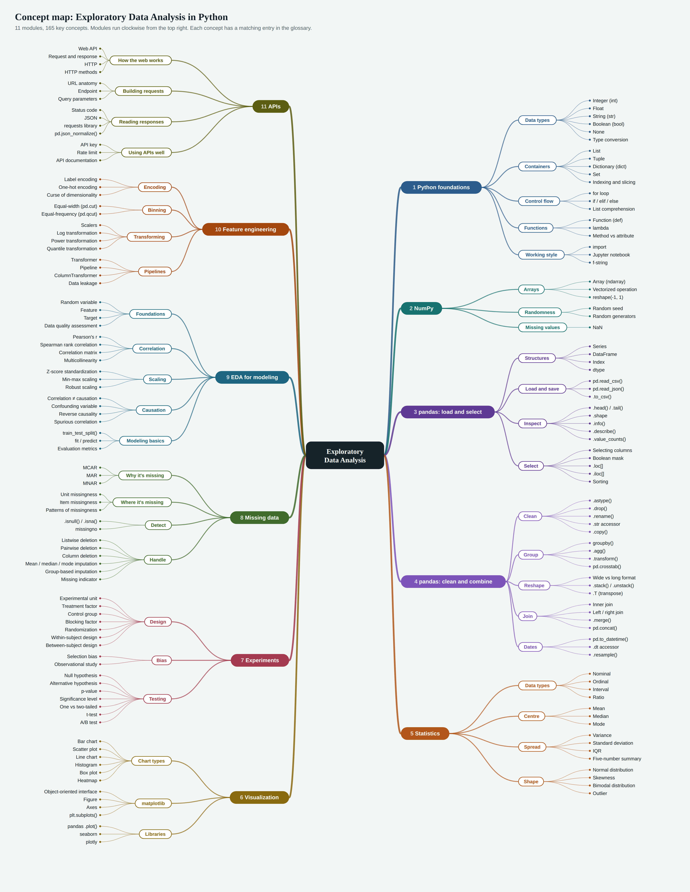

# Data Science Glossary: Python, pandas and Exploratory Data Analysis

Key terms, functions and methods from the EDA unit, running from Python basics to APIs. Each entry says what the term means, where it appears in the course, and (where relevant) shows working code.

**How to read the examples.** Most examples use the course's LEGO dataset loaded as `lego`, the Titanic dataset as `titanic`, or the synthetic `housing` data from the feature engineering notebook. They assume the standard imports: `import pandas as pd`, `import numpy as np`, `import matplotlib.pyplot as plt`, `import seaborn as sns`.

```python
import pandas as pd
import numpy as np
import matplotlib.pyplot as plt
import seaborn as sns

lego = pd.read_csv("https://raw.githubusercontent.com/CharleyHananiaGA/DSB-Unit-02/refs/heads/main/data/lego.csv")
titanic = pd.read_csv("https://raw.githubusercontent.com/datasciencedojo/datasets/master/titanic.csv")
```

## Contents

1. [Python foundations](#s1-python-foundations)
2. [NumPy essentials](#s2-numpy-essentials)
3. [pandas: loading, inspecting and selecting](#s3-pandas-loading-inspecting-and-selecting)
4. [pandas: cleaning, grouping, reshaping and joining](#s4-pandas-cleaning-grouping-reshaping-and-joining)
5. [Descriptive statistics and distributions](#s5-descriptive-statistics-and-distributions)
6. [Data visualization](#s6-data-visualization)
7. [Experimental design and hypothesis testing](#s7-experimental-design-and-hypothesis-testing)
8. [Missing data](#s8-missing-data)
9. [EDA for modeling](#s9-eda-for-modeling)
10. [Feature engineering](#s10-feature-engineering)
11. [APIs and web data](#s11-apis-and-web-data)

[Concept map](#concept-map) · [A–Z index](#a-z-index)

<a id="concept-map"></a>

## Concept map

The whole unit on one page: modules, grouped into themes, with the key concepts of each. Open the [clickable SVG version](assets/ds-eda-glossary-mindmap.svg) to jump straight to entries in the HTML glossary.

[](assets/ds-eda-glossary-mindmap.svg)

The same map as a linked outline:

- **[1. Python foundations](#s1-python-foundations)**
  - _Data types:_ [Integer (int)](#integer-int), [Float](#float), [String (str)](#string-str), [Boolean (bool)](#boolean-bool), [None](#none), [Type conversion](#type-conversion-casting)
  - _Containers:_ [List](#list), [Tuple](#tuple), [Dictionary (dict)](#dictionary-dict), [Set](#set), [Indexing and slicing](#indexing-and-slicing)
  - _Control flow:_ [for loop](#for-loop), [if / elif / else](#if-elif-else), [List comprehension](#list-comprehension)
  - _Functions:_ [Function (def)](#function-def), [lambda](#lambda), [Method vs attribute](#function-method-and-attribute)
  - _Working style:_ [import](#import), [Jupyter notebook](#jupyter-notebook), [f-string](#f-string)
- **[2. NumPy](#s2-numpy-essentials)**
  - _Arrays:_ [Array (ndarray)](#array-ndarray), [Vectorized operation](#vectorized-operation), [reshape(-1, 1)](#reshape-1-1)
  - _Randomness:_ [Random seed](#random-seed), [Random generators](#random-number-generators)
  - _Missing values:_ [NaN](#nan)
- **[3. pandas: load and select](#s3-pandas-loading-inspecting-and-selecting)**
  - _Structures:_ [Series](#series), [DataFrame](#dataframe), [Index](#index), [dtype](#dtype)
  - _Load and save:_ [pd.read_csv()](#pd-read-csv), [pd.read_json()](#pd-read-json), [.to_csv()](#to-csv)
  - _Inspect:_ [.head() / .tail()](#head-and-tail), [.shape](#shape), [.info()](#info), [.describe()](#describe), [.value_counts()](#value-counts)
  - _Select:_ [Selecting columns](#selecting-columns), [Boolean mask](#boolean-mask-filtering), [.loc[]](#loc), [.iloc[]](#iloc), [Sorting](#sort-values-and-sort-index)
- **[4. pandas: clean and combine](#s4-pandas-cleaning-grouping-reshaping-and-joining)**
  - _Clean:_ [.astype()](#astype), [.drop()](#drop), [.rename()](#rename), [.str accessor](#str-accessor), [.copy()](#copy)
  - _Group:_ [groupby()](#groupby), [.agg()](#agg), [.transform()](#transform), [pd.crosstab()](#pd-crosstab)
  - _Reshape:_ [Wide vs long format](#wide-vs-long-tidy-format), [.stack() / .unstack()](#stack-and-unstack), [.T (transpose)](#t-transpose)
  - _Join:_ [Inner join](#inner-join), [Left / right join](#left-right-join), [.merge()](#merge), [pd.concat()](#pd-concat)
  - _Dates:_ [pd.to_datetime()](#pd-to-datetime), [.dt accessor](#dt-accessor), [.resample()](#resample)
- **[5. Statistics](#s5-descriptive-statistics-and-distributions)**
  - _Data types:_ [Nominal](#nominal), [Ordinal](#ordinal), [Interval](#interval), [Ratio](#ratio)
  - _Centre:_ [Mean](#mean), [Median](#median), [Mode](#mode)
  - _Spread:_ [Variance](#variance), [Standard deviation](#standard-deviation), [IQR](#interquartile-range-iqr), [Five-number summary](#five-number-summary)
  - _Shape:_ [Normal distribution](#normal-gaussian-distribution), [Skewness](#skewness), [Bimodal distribution](#bimodal-multimodal-distribution), [Outlier](#outlier)
- **[6. Visualization](#s6-data-visualization)**
  - _Chart types:_ [Bar chart](#bar-chart), [Scatter plot](#scatter-plot), [Line chart](#line-chart), [Histogram](#histogram), [Box plot](#box-plot), [Heatmap](#heatmap)
  - _matplotlib:_ [Object-oriented interface](#object-oriented-interface), [Figure](#figure), [Axes](#axes), [plt.subplots()](#plt-subplots)
  - _Libraries:_ [pandas .plot()](#pandas-plot), [seaborn](#seaborn), [plotly](#plotly-plotly-express)
- **[7. Experiments](#s7-experimental-design-and-hypothesis-testing)**
  - _Design:_ [Experimental unit](#experimental-unit), [Treatment factor](#treatment-factor), [Control group](#control-group), [Blocking factor](#blocking-factor), [Randomization](#randomization), [Within-subject design](#within-subject-design), [Between-subject design](#between-subject-design)
  - _Bias:_ [Selection bias](#selection-bias), [Observational study](#observational-study)
  - _Testing:_ [Null hypothesis](#null-hypothesis-h), [Alternative hypothesis](#alternative-hypothesis-h), [p-value](#p-value), [Significance level](#significance-level), [One vs two-tailed](#one-tailed-vs-two-tailed-test), [t-test](#t-test-stats-ttest-ind), [A/B test](#a-b-test)
- **[8. Missing data](#s8-missing-data)**
  - _Why it's missing:_ [MCAR](#mcar-missing-completely-at-random), [MAR](#mar-missing-at-random), [MNAR](#mnar-missing-not-at-random)
  - _Where it's missing:_ [Unit missingness](#unit-missingness), [Item missingness](#item-missingness), [Patterns of missingness](#patterns-of-missingness)
  - _Detect:_ [.isnull() / .isna()](#isnull-isna), [missingno](#missingno)
  - _Handle:_ [Listwise deletion](#listwise-deletion-complete-case-analysis), [Pairwise deletion](#pairwise-deletion), [Column deletion](#column-deletion), [Mean / median / mode imputation](#mean-median-mode-imputation), [Group-based imputation](#group-based-imputation), [Missing indicator](#missing-indicator)
- **[9. EDA for modeling](#s9-eda-for-modeling)**
  - _Foundations:_ [Random variable](#random-variable), [Feature](#feature-independent-variable), [Target](#target-dependent-variable), [Data quality assessment](#data-quality-assessment)
  - _Correlation:_ [Pearson's r](#pearson-correlation-coefficient-r), [Spearman rank correlation](#spearman-rank-correlation), [Correlation matrix](#correlation-matrix), [Multicollinearity](#multicollinearity)
  - _Scaling:_ [Z-score standardization](#z-score-standardization), [Min-max scaling](#min-max-scaling-normalisation), [Robust scaling](#robust-scaling)
  - _Causation:_ [Correlation ≠ causation](#correlation-does-not-imply-causation), [Confounding variable](#confounding-variable), [Reverse causality](#reverse-causality), [Spurious correlation](#spurious-correlation)
  - _Modeling basics:_ [train_test_split()](#train-test-split), [fit / predict](#fit-predict), [Evaluation metrics](#evaluation-metrics-r-mse-rmse-mae-accuracy)
- **[10. Feature engineering](#s10-feature-engineering)**
  - _Encoding:_ [Label encoding](#label-encoding), [One-hot encoding](#one-hot-encoding), [Curse of dimensionality](#curse-of-dimensionality)
  - _Binning:_ [Equal-width (pd.cut)](#equal-width-binning-pd-cut), [Equal-frequency (pd.qcut)](#equal-frequency-binning-pd-qcut)
  - _Transforming:_ [Scalers](#standardscaler-minmaxscaler-robustscaler), [Log transformation](#log-transformation), [Power transformation](#power-transformation-box-cox-yeo-johnson), [Quantile transformation](#quantile-transformation)
  - _Pipelines:_ [Transformer](#transformer), [Pipeline](#pipeline), [ColumnTransformer](#columntransformer), [Data leakage](#data-leakage)
- **[11. APIs](#s11-apis-and-web-data)**
  - _How the web works:_ [Web API](#web-api), [Request and response](#request-and-response), [HTTP](#http), [HTTP methods](#http-methods-get-post-put-delete)
  - _Building requests:_ [URL anatomy](#url-anatomy), [Endpoint](#endpoint), [Query parameters](#query-parameters)
  - _Reading responses:_ [Status code](#status-code), [JSON](#json), [requests library](#requests-library), [pd.json_normalize()](#pd-json-normalize)
  - _Using APIs well:_ [API key](#api-key), [Rate limit](#rate-limit), [API documentation](#api-documentation)

---

<a id="s1-python-foundations"></a>

## 1. Python foundations

_The building blocks every notebook in the course relies on. If a pandas line confuses you, the answer is often in here: a list, a dictionary, a boolean or a function hiding inside it._

<a id="variable-and-assignment"></a>

### Variable and assignment

_Python_

A **variable** is a name that points to a value. The `=` sign means _assign_ (store the value on the right under the name on the left), not "equals". You can reassign a variable at any time, and the name then points to the new value.

```python
age = 41
age = age + 1      # reassign using the old value
print(age)         # 42
```

> **Watch out:** `=` assigns, `==` compares. `age == 42` asks a question and gives back `True` or `False`.

<a id="data-type"></a>

### Data type

_Python_

The **type** of a value decides what you can do with it: you can add two numbers, but you can't take the mean of a word. The core built-in types are `int`, `float`, `str`, `bool` and `None`, plus the container types `list`, `tuple`, `dict` and `set`. Use `type()` to check.

```python
type(3)          # int
type(3.5)        # float
type("3.5")      # str
type(True)       # bool
```

See also: [dtype](#dtype), [Type conversion (casting)](#type-conversion-casting)

<a id="integer-int"></a>

### Integer (int)

_Python_

A whole number with no decimal point, such as `7`, `-3` or `100_000` (underscores are allowed to make large numbers readable). Counts are usually integers: number of pieces in a LEGO set, number of customers.

```python
pieces = 1_254
pieces // 100    # 12  (floor division: whole-number result)
pieces % 100     # 54  (modulo: the remainder)
```

<a id="float"></a>

### Float

_Python_

A number with a decimal point, such as `19.99` or `-0.5`. Measurements and prices are usually floats. Dividing two integers with `/` always produces a float.

```python
price = 19.99
7 / 2            # 3.5
round(3.14159, 2)  # 3.14
```

> **Watch out:** Floats are stored approximately, so `0.1 + 0.2 == 0.3` is `False`. Use `round()` or `np.isclose()` when comparing decimals.

<a id="string-str"></a>

### String (str)

_Python_

Text, written inside single or double quotes: `"Star Wars"` or `'R '`. Strings can be joined with `+`, repeated with `*`, and indexed and sliced like lists. Column names, categories and URLs are all strings.

```python
theme = "Star Wars"
theme + " LEGO"       # 'Star Wars LEGO'
theme[0]              # 'S'
len(theme)            # 9
```

> **Watch out:** Strings that _look_ like numbers are still text: `"3" + "4"` is `"34"`, not `7`. This is why reading data sometimes gives you a text column that needs converting.

<a id="string-methods"></a>

### String methods

_Python_

Functions that belong to every string and return a new string. The ones used most in the course: `.upper()` / `.lower()` to standardise case, `.strip()` to remove leading and trailing spaces, `.replace(old, new)`, `.split(sep)` to break text into a list, and `.startswith()` / `.endswith()` to test the beginning or end.

```python
title = "  debt consolidation "
title.strip().upper()           # 'DEBT CONSOLIDATION'
"2019M02".startswith("20")      # True
"a, b, c".split(", ")           # ['a', 'b', 'c']
"On or near High St".replace("On or near ", "")  # 'High St'
```

> **Watch out:** In the product data, `'R '` has a trailing space, so `== 'R'` matches nothing. Always check for stray whitespace with `len()` or `.strip()`.

See also: [.str accessor](#str-accessor)

<a id="f-string"></a>

### f-string

_Python_

A string with an `f` in front that lets you drop variables and expressions straight into the text using `{}`. You can add a format code after a colon: `:.2f` for two decimal places, `:,` for thousands separators, `:.1%` for percentages.

```python
mean_age = 41.2567
print(f"Mean age: {mean_age:.1f}")          # Mean age: 41.3
print(f"Revenue: ${1234567:,.2f}")          # Revenue: $1,234,567.00
print(f"Retained: {0.873:.1%}")             # Retained: 87.3%
```

<a id="boolean-bool"></a>

### Boolean (bool)

_Python_

A value that is either `True` or `False`. Comparisons produce booleans, and booleans drive `if` statements and pandas filters. In arithmetic, `True` counts as 1 and `False` as 0, which is why `.sum()` on a boolean column counts the `True` values.

```python
55 > 40          # True
sum([True, False, True])   # 2
```

See also: [Boolean mask (filtering)](#boolean-mask-filtering)

<a id="none"></a>

### None

_Python_

Python's built-in value for "nothing here". A function that doesn't `return` anything gives back `None`. In pandas, `None` in a column is treated as missing, just like `NaN`.

```python
result = print("hi")   # print returns nothing
result is None         # True
```

See also: [NaN](#nan)

<a id="operators"></a>

### Operators

_Python_

Symbols that do something to values. **Arithmetic**: `+ - * / // % **` (the last is "to the power of"). **Comparison**: `== != < <= > >=`, which return booleans. **Logical**: `and`, `or`, `not` for combining booleans in plain Python. **Membership**: `in` checks whether something is inside a container.

```python
2 ** 3                  # 8
(5 > 3) and (2 > 4)     # False
"2020M01" in ["2020M01", "2019M02"]   # True
```

> **Watch out:** In pandas filters use `&`, `|` and `~` instead of `and`, `or`, `not`, and wrap each condition in brackets.

<a id="type-conversion-casting"></a>

### Type conversion (casting)

_Python_

Turning a value from one type into another with `int()`, `float()`, `str()` or `bool()`. You need it when building URLs from numbers or when text needs to become a number.

```python
lat = 51.5086
url = "https://data.police.uk/api/crimes-street/all-crime?lat=" + str(lat)
float("3.7")     # 3.7
int("2023")      # 2023
int(3.9)         # 3  (truncates, does not round)
```

> **Watch out:** `float("?")` raises a `ValueError`. Real datasets often contain placeholders like `"?"` or `"SONGFACTS.COM"` that block conversion until you clean them.

See also: [.astype()](#astype), [try / except](#try-except)

<a id="list"></a>

### List

_Python_

An ordered, changeable collection written with square brackets: `[1, 2, 3]`. Lists can hold any mix of types. You use them constantly to hold column names, keywords, or results collected inside a loop.

```python
cols = ["Name", "Theme", "Pieces"]
cols.append("USD_MSRP")    # add to the end
cols[0]                    # 'Name'
cols[-1]                   # 'USD_MSRP' (negative = count from the end)
len(cols)                  # 4
```

See also: [Indexing and slicing](#indexing-and-slicing), [List comprehension](#list-comprehension)

<a id="indexing-and-slicing"></a>

### Indexing and slicing

_Python_

**Indexing** picks one item by position, starting at `0`. **Slicing** picks a range with `start:stop`, where `stop` is _not_ included. Leave a side blank to go to the start or end. Works on lists, tuples and strings.

```python
months = ["Jan", "Feb", "Mar", "Apr", "May"]
months[1]      # 'Feb'
months[1:3]    # ['Feb', 'Mar']
months[:2]     # ['Jan', 'Feb']
months[-2:]    # ['Apr', 'May']
"2019M02"[:4]  # '2019'
```

> **Watch out:** Python counts from 0, so the "first" item is `[0]` and `[1:3]` gives two items, not three.

<a id="tuple"></a>

### Tuple

_Python_

An ordered collection like a list, but written with round brackets and **unchangeable** once created. pandas uses tuples for things that shouldn't change, like `df.shape`, and plotting functions take them for sizes like `figsize=(10, 6)`.

```python
shape = (1000, 14)     # rows, columns
rows, cols = shape     # tuple unpacking
rows                   # 1000
```

See also: [Tuple unpacking](#tuple-unpacking)

<a id="tuple-unpacking"></a>

### Tuple unpacking

_Python_

Assigning several variables at once from a tuple or list. You'll see it every time a function returns more than one thing: `fig, ax = plt.subplots()` or the four outputs of `train_test_split`.

```python
t_stat, p_value = (2.31, 0.024)
X_train, X_test, y_train, y_test = train_test_split(X, y, test_size=0.2)
```

<a id="dictionary-dict"></a>

### Dictionary (dict)

_Python_

A collection of **key-value pairs** in curly brackets: `{"key": value}`. You look things up by key rather than position. Dictionaries are everywhere in the course: building DataFrames, renaming columns, mapping categories to numbers, and reading JSON from APIs.

```python
condition_map = {"Poor": 0, "Fair": 1, "Good": 2, "Excellent": 3}
condition_map["Good"]          # 2
condition_map["Mint"] = 4      # add a new pair
list(condition_map.keys())     # ['Poor', 'Fair', 'Good', 'Excellent', 'Mint']
```

> **Watch out:** Looking up a key that doesn't exist raises a `KeyError`. Use `.get(key, default)` if the key might be missing.

See also: [Dictionary methods](#dictionary-methods), [JSON](#json)

<a id="dictionary-methods"></a>

### Dictionary methods

_Python_

`.keys()` gives all keys, `.values()` all values, `.items()` the pairs (great in a `for` loop), and `.get(key, default)` looks up safely. The `in` operator checks whether a key exists.

```python
counts = {"local-resolution": 3, "no-further-action": 7}
for outcome, n in counts.items():
    print(outcome, n)
sum(counts.values())                 # 10
"court-result" in counts             # False
counts.get("court-result", 0)        # 0
```

Example of looping through an irregular or nested disctionary to flatten the structure:

```python
import json
import pandas as pd

# 1. An unbalanced JSON payload (varying structures, nested dictionaries, missing keys)
json_payload = """
[
    {"id": 1, "name": "Alice", "info": {"city": "New York", "age": 28}},
    {"id": 2, "name": "Bob"},
    {"id": 3, "name": "Charlie", "info": {"city": "Chicago"}, "skills": ["Python", "SQL"]}
]
"""

# 2. Parse the JSON string
data_list = json.loads(json_payload)

# 3. Loop through the unbalanced payload to safely extract data
rows = []
for item in data_list:
    # Use .get() to avoid KeyError if a key is missing
    info_dict = item.get("info", {})

    row_data = {
        "ID": item.get("id"),
        "Name": item.get("name"),
        # Extracting from nested dictionary with default fallbacks
        "City": info_dict.get("city", "Unknown"),
        "Age": info_dict.get("age", None),
        # Handling a nested list by joining elements, or defaulting to empty string
        "Skills": ", ".join(item.get("skills", [])) if "skills" in item else "None"
    }
    rows.append(row_data)

# 4. Display in a DataFrame
df = pd.DataFrame(rows)
print(df)
```

<a id="nested-data"></a>

### Nested data

_Python, Concept_

Containers inside containers: a list of dictionaries, a dictionary whose values are dictionaries, and so on. API responses are almost always nested. You drill down one level at a time by chaining `[ ]`.

```python
crime = {"category": "burglary",
         "location": {"street": {"id": 1, "name": "On or near Park Lane"}}}
crime["location"]["street"]["name"]     # 'On or near Park Lane'
```

See also: [JSON](#json), [pd.json_normalize()](#pd-json-normalize)

<a id="set"></a>

### Set

_Python_

An unordered collection of **unique** values in curly brackets: `{"NY", "CA"}`. Adding a duplicate does nothing. Handy for de-duplicating or comparing two groups of values.

```python
set(["NY", "CA", "NY", "WA"])    # {'CA', 'NY', 'WA'}
{"a", "b"} & {"b", "c"}          # {'b'}  (in both)
```

<a id="built-in-functions"></a>

### Built-in functions

_Python_

Functions that come with Python without importing anything. The everyday ones: `print()`, `len()`, `type()`, `sum()`, `min()`, `max()`, `abs()`, `round()`, `sorted()`, `reversed()`, `list()`, `range()`, `enumerate()`, `isinstance()`.

```python
ages = [55, 43, 36, 31]
len(ages), sum(ages), min(ages), max(ages)   # (4, 165, 31, 55)
sorted(ages)                                  # [31, 36, 43, 55]
sorted(ages, reverse=True)                    # [55, 43, 36, 31]
abs(-0.75)                                    # 0.75
```

<a id="range"></a>

### range()

_Python_

Produces a sequence of whole numbers, most often to drive a `for` loop. `range(stop)`, `range(start, stop)` or `range(start, stop, step)`. Like slicing, `stop` is not included.

```python
list(range(5))         # [0, 1, 2, 3, 4]
list(range(1, 13))     # months 1 to 12
list(range(0, 10, 2))  # [0, 2, 4, 6, 8]
```

<a id="for-loop"></a>

### for loop

_Python_

Repeats a block of code once for every item in a collection. The indented lines are the loop body. In the API lab, loops request one month of data at a time and collect the results.

```python
dates = []
for year in [2023, 2024]:
    for month in range(1, 13):
        dates.append(f"{year}-{month}")
dates[:3]      # ['2023-1', '2023-2', '2023-3']
```

> **Watch out:** Avoid looping over the rows of a DataFrame to do maths. Vectorized pandas operations do the same job far faster.

See also: [Vectorized operation](#vectorized-operation), [enumerate()](#enumerate)

<a id="enumerate"></a>

### enumerate()

_Python_

Wraps a collection so a `for` loop gets both the position number and the item. Common when filling a grid of subplots one by one.

```python
for i, col in enumerate(["sqft", "price"]):
    print(i, col)
# 0 sqft
# 1 price
```

<a id="if-elif-else"></a>

### if / elif / else

_Python_

Runs code only when a condition is `True`. `elif` checks another condition if the first was false, and `else` catches everything left over.

```python
p_value = 0.03
if p_value < 0.05:
    print("Reject the null hypothesis")
else:
    print("Fail to reject the null hypothesis")
```

<a id="continue-and-break"></a>

### continue and break

_Python_

Loop controls. `continue` skips the rest of this pass and moves to the next item; `break` stops the loop entirely. The crimes lab uses `continue` to skip months where the API returns a 404.

```python
for code in [200, 404, 200]:
    if code == 404:
        continue        # skip this one
    print("process", code)
```

<a id="list-comprehension"></a>

### List comprehension

_Python_

A one-line way to build a new list from an existing one: `[expression for item in collection if condition]`. Used in the course to clean column names and pick out columns that match a pattern.

```python
cols = [" 2019M02", "2020M01 ", "country"]
clean = [c.strip() for c in cols]                 # ['2019M02', '2020M01', 'country']
numeric_cols = [c for c in clean if c.startswith("20")]
[x ** 2 for x in [1, 2, 3]]                         # [1, 4, 9]
```

<a id="function-def"></a>

### Function (def)

_Python_

A named, reusable block of code. `def` defines it, the names in brackets are **parameters** (inputs), and `return` sends a result back. Writing functions keeps notebooks tidy and lets you repeat an analysis on new data.

```python
def price_per_piece(price, pieces):
    """Return the price of one LEGO piece."""
    return price / pieces

price_per_piece(99.99, 1000)    # 0.09999
```

See also: [Arguments and parameters](#arguments-and-parameters), [Docstring](#docstring), [lambda](#lambda)

<a id="arguments-and-parameters"></a>

### Arguments and parameters

_Python_

**Parameters** are the names a function expects; **arguments** are the actual values you pass in. **Positional** arguments go in order; **keyword** arguments are named (`bins=20`) and can go in any order. Many parameters have **default values** that apply if you leave them out.

```python
def describe_age(age, unit="years"):     # unit has a default
    return f"{age} {unit}"

describe_age(41)                 # '41 years'
describe_age(41, unit="yrs")     # '41 yrs'
```

<a id="docstring"></a>

### Docstring

_Python_

The text in triple quotes at the top of a function that explains what it does. Jupyter shows it when you press Shift+Tab or run `help(function_name)`.

```python
def identify_data_issues(df):
    """Return missing values, duplicates and outliers for a DataFrame."""
    ...
```

<a id="lambda"></a>

### lambda

_Python_

A tiny unnamed function written in one line: `lambda inputs: result`. Handy as a quick argument to `.apply()` or as the `key` when sorting.

```python
square = lambda x: x ** 2
square(4)                                         # 16
pairs = [("a", -0.9), ("b", 0.3)]
sorted(pairs, key=lambda p: abs(p[1]), reverse=True)   # strongest first
```

See also: [.apply()](#apply)

<a id="try-except"></a>

### try / except

_Python_

Error handling. Python tries the code in `try`; if it raises an error, the `except` block runs instead of crashing. The rock music lab uses this to convert values to numbers and fall back to `NaN` for anything that won't convert.

```python
import numpy as np

def to_float(value):
    try:
        return float(value)
    except ValueError:
        return np.nan

to_float("1971"), to_float("SONGFACTS.COM")   # (1971.0, nan)
```

<a id="module-package-and-library"></a>

### Module, package and library

_Python_

A **module** is a single Python file of reusable code; a **package** is a folder of modules; **library** is the everyday word for a package you install, like pandas or scikit-learn. Python's **standard library** (e.g. `datetime`, `random`, `re`, `calendar`) comes pre-installed; others are installed with `pip`.

See also: [import](#import), [pip](#pip)

<a id="import"></a>

### import

_Python_

Loads a library so you can use it. `import x as y` gives it a short alias, and `from x import y` brings in one specific piece. The course uses standard aliases that everyone recognises.

```python
import pandas as pd
import numpy as np
import matplotlib.pyplot as plt
import seaborn as sns
from scipy import stats
from sklearn.preprocessing import StandardScaler
```

> **Watch out:** Stick to the standard aliases (`pd`, `np`, `plt`, `sns`, `px`). Other people's code, and most online answers, assume them.

<a id="pip"></a>

### pip

_Python_

Python's package installer. In a terminal: `pip install missingno`. Inside a Jupyter cell, put `!` or `%` in front.

```python
%pip install missingno
```

<a id="function-method-and-attribute"></a>

### Function, method and attribute

_Python, Concept_

A **function** stands alone: `len(df)`. A **method** is a function that belongs to an object and is called with a dot and brackets: `df.head()`. An **attribute** is stored information about an object, accessed with a dot but _no_ brackets: `df.shape`, `df.columns`.

```python
len(lego)       # function
lego.head()     # method  (brackets)
lego.shape      # attribute (no brackets)
```

> **Watch out:** `lego.shape()` raises `TypeError: 'tuple' object is not callable`. If you see "not callable", you've put brackets on an attribute.

<a id="object-class-and-instance"></a>

### Object, class and instance

_Python, Concept_

A **class** is a blueprint; an **object** (or **instance**) is one thing built from it. `pd.DataFrame` is a class and each DataFrame you load is an instance. scikit-learn works the same way: you create an instance like `scaler = StandardScaler()`, then call its methods.

```python
scaler = StandardScaler()   # create an instance of the class
type(scaler)                # sklearn.preprocessing._data.StandardScaler
```

<a id="inheritance"></a>

### Inheritance

_Python_

A class can be built on top of another class and **inherit** its abilities. Custom scikit-learn transformers inherit from `BaseEstimator` and `TransformerMixin`, which gives them `fit_transform()` for free.

```python
class AgeTransformer(BaseEstimator, TransformerMixin):
    def fit(self, X, y=None):
        return self
    def transform(self, X):
        X = X.copy()
        X["age"] = 2025 - X["year_built"]
        return X
```

See also: [Custom transformer](#custom-transformer)

<a id="datetime-module"></a>

### datetime module

_Python_

Python's standard library for dates and times. `datetime.datetime.today()` (or `.now()`) gives the current moment, and `datetime.datetime(year, month, day)` builds a specific date.

```python
import datetime
current_year = datetime.datetime.today().year
datetime.datetime(2020, 1, 1)
```

See also: [pd.to_datetime()](#pd-to-datetime)

<a id="re-regular-expressions"></a>

### re (regular expressions)

_Python_

A standard library module for pattern matching in text. `re.sub(pattern, replacement, text)` replaces everything matching a pattern. Characters like `[`, `]` and `.` have special meanings and must be escaped with a backslash.

```python
import re
line = "[u'Tim Robbins', u'Morgan Freeman']"
line = re.sub(r"u'", "'", line)
line = re.sub(r"['\[\]]", "", line)
line.split(", ")      # ['Tim Robbins', 'Morgan Freeman']
```

<a id="random-module"></a>

### random module

_Python_

Python's built-in random number tools. `random.random()` gives a float between 0 and 1. For data work you'll mostly use NumPy's random functions instead because they produce whole arrays at once.

See also: [Random seed](#random-seed)

<a id="jupyter-notebook"></a>

### Jupyter notebook

_Python, Concept_

An interactive document made of **cells**. **Code cells** run Python and show the output below; **Markdown cells** hold formatted notes. Variables persist between cells, so the order you run cells in matters. The value of the last line in a cell is displayed automatically.

> **Watch out:** If results look odd, use "Restart Kernel and Run All" to make sure cells ran top to bottom with nothing left over from earlier experiments.

<a id="magic-commands"></a>

### Magic commands

_Python_

Special Jupyter commands starting with `%` (one line) or `%%` (whole cell). `%matplotlib inline` shows plots inside the notebook, `%%timeit` times a cell (used to prove vectorized pandas is faster than a loop), and `!` runs a terminal command.

```python
%matplotlib inline
%%timeit
squared = [n ** 2 for n in range(100_000)]
```

<a id="trailing-semicolon"></a>

### Trailing semicolon

_Python_

Ending the last line of a cell with `;` hides its text output. In plotting cells it stops Jupyter printing lines like `<Axes: ...>` above the chart.

```python
lego["USD_MSRP"].hist(bins=50);
```

<a id="warnings-and-filterwarnings"></a>

### Warnings and filterwarnings

_Python_

A **warning** is Python telling you something might be wrong without stopping the code. `warnings.filterwarnings('ignore')` hides them, which keeps teaching notebooks clean.

```python
import warnings
warnings.filterwarnings("ignore")
```

> **Watch out:** Hiding warnings in your own work can hide real problems. Read them first, then decide.

---

<a id="s2-numpy-essentials"></a>

## 2. NumPy essentials

_NumPy is the fast number-crunching engine underneath pandas. You'll use it directly for maths on whole columns, generating random or synthetic data, and the occasional reshape before scikit-learn._

<a id="numpy"></a>

### NumPy

_NumPy_

The core Python library for fast numerical computing, imported as `np`. Its main object is the **array**. pandas is built on NumPy arrays, which is a big reason pandas is fast.

```python
import numpy as np
```

<a id="array-ndarray"></a>

### Array (ndarray)

_NumPy_

A grid of values that all share one type. A 1-D array is like a list of numbers; a 2-D array is like a table. Maths on an array applies to every element at once. `df["col"].values` (or `.to_numpy()`) gives you the array behind a pandas column.

```python
a = np.array([55, 43, 36, 31])
a * 2          # array([110,  86,  72,  62])
a.mean()       # 41.25
a.shape        # (4,)
```

<a id="vectorized-operation"></a>

### Vectorized operation

_NumPy, pandas, Concept_

Doing an operation on a whole array or column in one go, without writing a `for` loop. The work happens in fast compiled C code, so it's typically many times quicker than looping in Python. It's also shorter and easier to read.

```python
numbers = range(100_000)

# slow: Python loop
squared = []
for n in numbers:
    squared.append(n ** 2)

# fast: vectorized
squared = pd.Series(numbers) ** 2
```

<a id="nan"></a>

### NaN

_NumPy, pandas_

"Not a Number": the standard marker for a missing numeric value, written `np.nan`. Any maths involving `NaN` gives `NaN`, but pandas methods like `.mean()` skip it by default. `NaN` is never equal to anything, including itself, so use `.isnull()` to find it.

```python
np.nan == np.nan                 # False (!)
pd.Series([1, np.nan, 3]).mean() # 2.0  (NaN skipped)
```

See also: [Missing data](#missing-data), [.isnull() / .isna()](#isnull-isna)

<a id="random-seed"></a>

### Random seed

_NumPy_

A starting number for the random number generator. Setting the same seed makes "random" results identical every time you run the notebook, so your analysis is **reproducible**. The course uses `42` by convention.

```python
np.random.seed(42)
np.random.normal(0, 1, 3)   # same three numbers every run
```

See also: [random_state](#random-state)

<a id="random-number-generators"></a>

### Random number generators

_NumPy_

NumPy functions for generating synthetic data with a chosen distribution. `np.random.normal(mean, sd, n)` for bell-shaped data, `uniform(low, high, n)` for evenly spread data, `exponential(scale, n)` for right-skewed data like income, `randint(low, high, n)` for whole numbers, `choice(options, n, p=probs)` for categories, and `randn(rows, cols)` for standard-normal tables.

```python
heights = np.random.normal(170, 10, 1000)
incomes = np.random.exponential(50_000, 1000)       # right-skewed
years   = np.random.randint(1950, 2023, 1000)
hoods   = np.random.choice(["Downtown", "Suburb"], 1000, p=[0.3, 0.7])
```

<a id="math-functions-np-log-np-exp-np-sqrt-np-abs"></a>

### Math functions (np.log, np.exp, np.sqrt, np.abs)

_NumPy_

Element-wise maths on arrays or pandas columns. `np.log` is the natural log (used to tame right skew), `np.exp` reverses it, `np.sqrt` is the square root (used to get RMSE from MSE), and `np.abs` is the absolute value.

```python
income = pd.Series([30_000, 45_000, 250_000])
np.log(income)               # compresses the big value
np.exp(np.log(income))       # back to the original
np.sqrt(400_000_000)         # 20000.0
```

See also: [Log transformation](#log-transformation)

<a id="np-arange-and-np-linspace"></a>

### np.arange() and np.linspace()

_NumPy_

Create evenly spaced numbers. `np.arange(start, stop, step)` works like `range()` but allows decimals; `np.linspace(start, stop, n)` gives exactly `n` points including both ends.

```python
np.arange(0, 1, 0.25)      # array([0.  , 0.25, 0.5 , 0.75])
np.linspace(0, 10, 5)      # array([ 0. ,  2.5,  5. ,  7.5, 10. ])
```

<a id="reshape-1-1"></a>

### reshape(-1, 1)

_NumPy, scikit-learn_

Changes an array's shape. scikit-learn expects features as a 2-D table (rows by columns), so a single column of values often needs reshaping first. `-1` means "work out this dimension for me".

```python
values = housing_df["median_house_value"].values   # shape (n,)
X = values.reshape(-1, 1)                           # shape (n, 1)
```

> **Watch out:** Selecting with double brackets, `df[["col"]]`, gives a one-column DataFrame, which scikit-learn already accepts, so you often don't need to reshape at all.

<a id="flatten-and-ravel"></a>

### flatten() and ravel()

_NumPy_

Collapse a multi-dimensional array into 1-D. You'll see `axes = axes.flatten()` after `plt.subplots(2, 2)` so you can loop over the four subplots with a single index.

```python
fig, axes = plt.subplots(2, 2)
axes = axes.flatten()      # now axes[0] ... axes[3]
```

<a id="np-maximum-and-np-clip"></a>

### np.maximum() and np.clip()

_NumPy_

Keep values within limits. `np.maximum(0, x)` replaces negatives with 0; `np.clip(x, low, high)` caps values at both ends (e.g. test scores between 0 and 100).

```python
np.maximum(0, np.array([-2, 5]))         # array([0, 5])
np.clip(np.array([-5, 50, 120]), 0, 100) # array([  0,  50, 100])
```

<a id="np-triu-and-np-ones-like"></a>

### np.triu() and np.ones_like()

_NumPy, seaborn_

Used together to build a **mask** that hides the upper triangle of a correlation heatmap, since a correlation matrix is symmetrical and the top half repeats the bottom half.

```python
corr = df.corr(numeric_only=True)
mask = np.triu(np.ones_like(corr, dtype=bool))
sns.heatmap(corr, mask=mask, annot=True, cmap="coolwarm", center=0)
```

<a id="np-polyfit"></a>

### np.polyfit()

_NumPy_

Fits a straight line (or curve) through points and returns its coefficients. With `deg=1` you get the slope and intercept of a trend line to draw on a scatter plot.

```python
x = np.array([1, 2, 3, 4]); y = np.array([2.1, 3.9, 6.2, 7.8])
slope, intercept = np.polyfit(x, y, 1)
```

---

<a id="s3-pandas-loading-inspecting-and-selecting"></a>

## 3. pandas: loading, inspecting and selecting

_pandas is the main tool of the course. This section covers getting data in, looking at it, and picking out the rows and columns you want. Most examples use the LEGO dataset from the course repo._

<a id="pandas"></a>

### pandas

_pandas_

The most popular Python library for exploring, cleaning, joining and visualising tabular data, imported as `pd`. It's fast (built on NumPy, uses vectorized operations), reads almost any data source, and makes analysis reproducible.

```python
import pandas as pd
lego = pd.read_csv("https://raw.githubusercontent.com/CharleyHananiaGA/DSB-Unit-02/refs/heads/main/data/lego.csv")
```

<a id="series"></a>

### Series

_pandas_

A **one-dimensional** labelled array: a single column (or row) of data with an index. Selecting one column of a DataFrame with single brackets gives you a Series.

```python
ages = pd.Series([55, 43, 36, 31], name="age")
type(lego["Name"])      # pandas.core.series.Series
```

<a id="dataframe"></a>

### DataFrame

_pandas_

A **two-dimensional** table of data with labelled rows (the index) and columns. Each column is a Series and each column can have its own type. Once data is loaded, a DataFrame behaves the same whether it came from a CSV, JSON, an API or a database.

```python
customers = pd.DataFrame({
    "customer_id": [505, 196, 947, 952],
    "surname": ["Smith", "Peck", "Murdock", "Baracus"],
    "age": [55, 43, 36, 31],
})
```

> **Watch out:** A list of dictionaries also works: `pd.DataFrame(api_json)` turns each dictionary into a row. This is the usual first step with API data.

<a id="index"></a>

### Index

_pandas_

The row labels of a Series or DataFrame, shown in bold on the left. By default it's `0, 1, 2, ...`, but it can be names, dates or any unique-ish values. A **DatetimeIndex** (dates as the index) unlocks time-series tools like `.resample()`.

```python
lego.index                       # RangeIndex(start=0, stop=..., step=1)
lego.set_index("Name").head()    # use set names as the row labels
```

See also: [.set_index() and .reset_index()](#set-index-and-reset-index)

<a id="dtype"></a>

### dtype

_pandas_

The data type of a pandas column. Common ones: `int64` (whole numbers), `float64` (decimals, and any numeric column containing `NaN`), `bool`, `datetime64` (dates), `category`, and `object` or `str` (text; pandas 3 shows `str`). Checking dtypes is one of the first EDA steps because a wrong dtype blocks analysis.

```python
lego.dtypes
```

> **Watch out:** A number column showing as `object` usually means some value isn't a number (e.g. `"?"` in the auto MPG data). Find it before converting.

<a id="pd-read-csv"></a>

### pd.read_csv()

_pandas_

Reads a CSV (comma-separated) file from a path or URL into a DataFrame. Useful options from the course: `sep="\t"` for tab-separated files, `names=[...]` to set column names, `skiprows=1` to skip the original header, `header=0`, `encoding="latin-1"` for files with special characters, and `na_filter=False` to stop text like `"NA"` being read as missing.

```python
lego = pd.read_csv("../data/lego.csv")
bonds = pd.read_csv("../data/eu-govt-bonds.tsv", sep="\t")
codes = pd.read_csv("../data/country-codes.csv", encoding="latin-1")
rock  = pd.read_csv("../data/rock.csv", names=["song", "artist"], skiprows=1)
```

> **Watch out:** `na_filter=False` matters for the drinks data: the continent code for North America is `"NA"`, which pandas would otherwise turn into missing values.

<a id="pd-read-json"></a>

### pd.read_json()

_pandas_

Reads a JSON file or URL into a DataFrame. Works best when the JSON is a flat list of records; nested JSON usually needs `pd.json_normalize()`.

```python
cpi = pd.read_json("https://raw.githubusercontent.com/CharleyHananiaGA/DSB-Unit-02/refs/heads/main/data/cpi.json")
```

<a id="to-csv"></a>

### .to_csv()

_pandas_

Saves a DataFrame to a CSV file. Use `index=False` unless the index holds real information (like dates), otherwise you get an unnamed extra column when you read the file back.

```python
filtered.to_csv("lego_filtered.csv", index=False)
```

<a id="head-and-tail"></a>

### .head() and .tail()

_pandas_

Show the first or last rows (5 by default). Always the first thing to run after loading data, to check it looks the way you expect.

```python
lego.head()      # first 5 rows
lego.head(10)    # first 10
lego.tail(3)     # last 3
```

<a id="shape"></a>

### .shape

_pandas_

An attribute giving `(rows, columns)` as a tuple. No brackets after it. Check it before and after filtering or joining to see how many rows you kept or gained.

```python
lego.shape        # e.g. (2462, 14)
lego.shape[0]     # number of rows
```

<a id="info"></a>

### .info()

_pandas_

Prints a summary of a DataFrame: number of rows, each column's name, its count of non-null values and its dtype, plus memory use. The quickest way to spot missing values and wrong types together.

```python
lego.info()
```

<a id="describe"></a>

### .describe()

_pandas_

Summary statistics for numeric columns: count, mean, standard deviation, min, 25%, 50% (median), 75% and max, which includes the **five-number summary**. Pass `percentiles=` for extra cut points, or `include="object"` to summarise text columns.

```python
lego["USD_MSRP"].describe()
lego["Pieces"].describe(percentiles=np.arange(0, 1, 0.05))
lego.describe(include="object")
```

<a id="columns"></a>

### .columns

_pandas_

The column labels of a DataFrame. Use `.tolist()` to get a plain list. You can reassign it to rename every column at once.

```python
lego.columns.tolist()
bonds.columns = [c.strip() for c in bonds.columns]   # clean all names
```

<a id="values-to-numpy"></a>

### .values / .to_numpy()

_pandas, NumPy_

Returns the underlying NumPy array of a Series or DataFrame, without the index and column labels.

```python
lego["Pieces"].values[:5]
```

<a id="selecting-columns"></a>

### Selecting columns

_pandas_

Single brackets with one name give a **Series**; double brackets with a list give a **DataFrame**. Dot notation (`movies.duration`) also works for simple names without spaces, but brackets always work.

```python
lego["Pieces"]                         # Series
lego[["Name", "Theme", "Pieces"]]      # DataFrame
```

> **Watch out:** `lego["Name", "Theme"]` (single brackets, two names) raises a `KeyError`. The inner brackets make the list.

<a id="boolean-mask-filtering"></a>

### Boolean mask (filtering)

_pandas_

A Series of `True`/`False` values, one per row, produced by a comparison. Put it inside `[ ]` to keep only the `True` rows. Giving the mask a name makes code easier to read.

```python
is_expensive = lego["USD_MSRP"] > 100
lego[is_expensive]
lego[lego["Theme"] == "Star Wars"]
```

See also: [Combining conditions (& | ~)](#combining-conditions)

<a id="combining-conditions"></a>

### Combining conditions (& | ~)

_pandas_

`&` means AND (both true), `|` means OR (either true), `~` means NOT (flip). Each condition must be wrapped in its own brackets because of operator precedence.

```python
recent_star_wars = (lego["Year"] >= 2015) & (lego["Theme"] == "Star Wars")
lego[recent_star_wars]
lego[(lego["Year"] >= 2015) | (lego["Pieces"] > 2000)]
lego[~lego["Theme"].isin(["Star Wars", "Technic"])]
```

> **Watch out:** Python's `and`/`or` raise "The truth value of a Series is ambiguous". Swap them for `&` and `|`.

<a id="isin"></a>

### .isin()

_pandas_

Checks each value against a list and returns a boolean mask. Cleaner than chaining lots of `|` conditions.

```python
ufo[ufo["State"].isin(["NY", "CA", "WA"])]
```

<a id="loc"></a>

### .loc[]

_pandas_

Selects by **label**: `df.loc[rows, columns]`. Rows can be index labels or a boolean mask; columns are names. Also the safe way to **update** a subset of values in place.

```python
lego.loc[lego["Pieces"] > 5000, ["Name", "Pieces"]]
lego.loc[:, lego.isnull().mean() < 0.3]          # columns under 30% missing
bonds.loc[bonds["country_code"] == "UK", "Country"] = "United Kingdom"
```

<a id="iloc"></a>

### .iloc[]

_pandas_

Selects by **integer position**: `df.iloc[row_numbers, column_numbers]`, starting at 0, with slicing that excludes the end point, exactly like Python lists.

```python
movies.iloc[0]           # first row
movies.iloc[:5, :2]      # first 5 rows, first 2 columns
corr.iloc[0, 1]          # value at row 0, column 1
```

> **Watch out:** `.loc` slices include the end label, `.iloc` slices exclude the end position.

<a id="sort-values-and-sort-index"></a>

### .sort_values() and .sort_index()

_pandas_

`.sort_values(by)` orders rows by one or more columns (`ascending=False` for largest first). `.sort_index()` orders by the index, which is how you put `value_counts()` output into year or rating order.

```python
lego.sort_values("USD_MSRP", ascending=False).head()
lego["Year"].value_counts().sort_index()
```

<a id="value-counts"></a>

### .value_counts()

_pandas_

Counts how many times each unique value appears, sorted most-common first. The go-to summary for a categorical column. `normalize=True` gives proportions instead of counts.

```python
lego["Theme_Group"].value_counts()
lego["Category"].value_counts(normalize=True)
```

<a id="unique-and-nunique"></a>

### .unique() and .nunique()

_pandas_

`.unique()` lists the distinct values in a column; `.nunique()` counts them. The count is the column's **cardinality**.

```python
lego["Theme"].nunique()      # how many themes
lego["Theme_Group"].unique()
```

> **Watch out:** `.nunique()` ignores `NaN` by default; `.unique()` includes it.

See also: [Cardinality](#cardinality)

<a id="duplicated"></a>

### .duplicated()

_pandas_

Returns `True` for each row (or value) that repeats an earlier one. `.sum()` counts duplicates; `.drop_duplicates()` removes them.

```python
lego.duplicated().sum()                  # fully duplicated rows
movies[movies["title"].duplicated()]     # repeated titles
```

<a id="pd-set-option"></a>

### pd.set_option()

_pandas_

Changes how pandas displays output, for example showing every column of a wide DataFrame instead of `...`.

```python
pd.set_option("display.max_columns", None)
```

---

<a id="s4-pandas-cleaning-grouping-reshaping-and-joining"></a>

## 4. pandas: cleaning, grouping, reshaping and joining

_Turning raw data into the shape your question needs: fixing columns, summarising by group, switching between wide and long formats, combining tables and working with dates._

<a id="creating-a-new-column"></a>

### Creating a new column

_pandas_

Assign to a column name that doesn't exist yet. The calculation is vectorized, so it runs on every row at once.

```python
lego["price_per_piece"] = lego["USD_MSRP"] / lego["Pieces"]
lego["Age"] = 2025 - lego["Year"]
```

<a id="drop"></a>

### .drop()

_pandas_

Removes columns or rows. Use `columns=[...]` for columns (clearest), or the older `axis=1` form. Without `inplace=True` or reassignment it returns a new DataFrame and the original is unchanged.

```python
lego = lego.drop(columns=["Owned"])
housing.drop(["id", "price"], axis=1)
df.drop(df[df["country_code"] == "EE"].index)   # drop rows by index
```

> **Watch out:** Running `lego.drop(columns=["Owned"])` on its own line does nothing lasting. Assign the result back.

<a id="axis"></a>

### axis

_pandas, NumPy, Concept_

Tells a method which direction to work in. `axis=0` (the default) means _down the rows_, giving one result per column; `axis=1` means _across the columns_, giving one result per row. For `.drop()`, `axis=1` means "drop columns".

```python
bonds_table.mean(axis=0)   # average of each column (each month)
bonds_table.mean(axis=1)   # average of each row (each country)
```

<a id="rename"></a>

### .rename()

_pandas_

Renames columns (or index labels) using a dictionary of `{old: new}`. Only the names in the dictionary change.

```python
rock = rock.rename(columns={"Song Clean": "song", "ARTIST CLEAN": "artist"})
```

<a id="astype"></a>

### .astype()

_pandas_

Converts a column to a different dtype. It fails if any value can't be converted, which is a useful signal that there's dirty data to find.

```python
auto = auto[auto["horsepower"] != "?"].copy()
auto["horsepower"] = auto["horsepower"].astype(float)
titanic["Age_missing"] = titanic["Age"].isnull().astype(int)   # True/False -> 1/0
```

See also: [pd.to_numeric()](#pd-to-numeric)

<a id="pd-to-numeric"></a>

### pd.to_numeric()

_pandas_

Converts a column to numbers. With `errors="coerce"`, anything that can't be converted becomes `NaN` instead of raising an error. A one-line alternative to the `try/except` helper in the rock music lab.

```python
rock["release"] = pd.to_numeric(rock["release"], errors="coerce")
```

<a id="copy"></a>

### .copy()

_pandas_

Makes an independent copy of a DataFrame. Use it when you filter a DataFrame and then plan to change the result, or when you want to try a cleaning method without touching the original.

```python
recent = lego[lego["Age"] < 10].copy()
recent["new_column"] = "new value"     # safe: no warning
df_mean_imputed = titanic.copy()
```

See also: [SettingWithCopyWarning](#settingwithcopywarning)

<a id="settingwithcopywarning"></a>

### SettingWithCopyWarning

_pandas_

A warning (pandas 2.x and earlier) that you're changing a DataFrame that might be a _view_ of another one, so your change may not stick or may change the original unexpectedly. It appears when you filter and then assign. Fix it by adding `.copy()` after the filter, or by using `.loc` on the original.

> **Watch out:** pandas 3 switched to "Copy-on-Write": this warning is gone and filtered results always behave as copies. The `.copy()` habit still works in every version.

<a id="inplace-true"></a>

### inplace=True

_pandas_

Makes a method change the DataFrame directly instead of returning a new one. Reassigning (`df = df.drop(...)`) does the same job and is the style pandas now recommends.

```python
df.drop(columns=["diff"], inplace=True)     # same as:
df = df.drop(columns=["diff"])
```

> **Watch out:** `df["col"].fillna(0, inplace=True)` (inplace on a single selected column) is unreliable, and under pandas 3 it no longer updates the DataFrame at all. Write `df["col"] = df["col"].fillna(0)` instead.

<a id="method-chaining"></a>

### Method chaining

_pandas, Concept_

Calling several methods one after another, each working on the result of the previous one. Wrap the chain in brackets to split it over several lines with one step per line, which reads like a recipe.

```python
(
    lego.groupby("Theme_Group")["USD_MSRP"]
        .median()
        .dropna()
        .sort_values(ascending=False)
        .head(5)
)
```

<a id="replace"></a>

### .replace()

_pandas_

Swaps specific values for others across a Series or DataFrame. Accepts a single value, a list, or a dictionary.

```python
movies["content_rating"] = movies["content_rating"].replace(
    ["NOT RATED", "APPROVED", "PASSED", "GP"], "UNRATED")
```

<a id="map"></a>

### .map()

_pandas_

Transforms each value in a Series using a dictionary or a function. With a dictionary, values not in it become `NaN`. It's the simplest way to do label encoding of an ordered category.

```python
condition_map = {"Poor": 0, "Fair": 1, "Good": 2, "Excellent": 3}
housing["condition_encoded"] = housing["condition"].map(condition_map)
```

See also: [Label encoding](#label-encoding)

<a id="apply"></a>

### .apply()

_pandas_

Runs a function on each value of a Series, or on each column (`axis=0`) or each row (`axis=1`) of a DataFrame. Flexible but slower than vectorized code, so use it when there's no built-in alternative.

```python
movies["n_chars"] = movies["title"].apply(len)
movies["actor_0"] = movies["cleanlist"].apply(lambda actors: actors[0])
```

<a id="str-accessor"></a>

### .str accessor

_pandas_

Gives access to vectorized string methods for a whole text column: `.str.upper()`, `.str.strip()`, `.str.replace()`, `.str.contains()`, `.str.startswith()`, `.str.split()` and slicing like `.str[-2:]`.

```python
loans["title_upper"] = loans["Loan Title"].str.upper()
loans[loans["title_upper"].str.contains("DEBT")]
crimes["category"] = crimes["category"].str.replace("-", " ")
bonds["country_code"] = bonds["int_rt,geo\\time"].str[-2:]
```

> **Watch out:** `.str.contains()` returns `NaN` for missing text, which breaks filtering. Drop or fill missing values first, or pass `na=False`.

<a id="groupby"></a>

### groupby()

_pandas_

Splits rows into groups by one or more columns, applies a calculation to each group, and combines the results into a new table. This pattern is called **split-apply-combine**. On its own, `groupby()` does nothing visible until you add a calculation.

```python
lego.groupby("Theme_Group")["USD_MSRP"].median()
lego.groupby("Theme_Group")["Price"].describe()
titanic.groupby(["Pclass", "Sex"])["Age"].mean()
```

See also: [Split-apply-combine](#split-apply-combine), [.agg()](#agg), [.transform()](#transform)

<a id="split-apply-combine"></a>

### Split-apply-combine

_pandas, Concept_

The idea behind `groupby`: **split** the data into groups, **apply** a function (mean, count, max...) to each group separately, then **combine** the answers into one result. It's how you answer "which theme group is most expensive?" in one line.

<a id="agg"></a>

### .agg()

_pandas_

Calculates several statistics at once. Pass a list to apply the same functions to everything, or a dictionary to apply different functions to different columns.

```python
lego["USD_MSRP"].agg(["min", "max"])
lego.groupby("Theme_Group").agg({"USD_MSRP": "median", "Pieces": "max"})
movies.groupby("genre")["star_rating"].agg(["count", "mean"])
```

<a id="transform"></a>

### .transform()

_pandas_

Like `.agg()` after a `groupby`, but returns a result **the same length as the original**, with each row getting its group's value. That makes it perfect for group-based imputation.

```python
group_means = titanic.groupby(["Pclass", "Sex"])["Age"].transform("mean")
titanic["Age"] = titanic["Age"].fillna(group_means)
```

See also: [Group-based imputation](#group-based-imputation)

<a id="size-and-count"></a>

### .size() and .count()

_pandas_

After a `groupby`, `.size()` counts rows per group (including missing values) and `.count()` counts non-missing values per column.

```python
lego.groupby("Year").size()
```

<a id="idxmin-and-idxmax"></a>

### .idxmin() and .idxmax()

_pandas_

Return the **index label** where the minimum or maximum value sits, rather than the value itself. Answers "which country had the lowest rate?" directly.

```python
jan_rates.set_index("Country")["2020M01"].idxmin()
```

<a id="pd-crosstab"></a>

### pd.crosstab()

_pandas_

Builds a frequency table counting combinations of two categorical columns. `normalize="index"` turns each row into proportions. A crosstab is ready to plot as a heatmap.

```python
pd.crosstab(lego["Theme_Group"], lego["Category"])
pd.crosstab(lego["Theme_Group"], lego["Category"], normalize="index") * 100
```

<a id="set-index-and-reset-index"></a>

### .set_index() and .reset_index()

_pandas_

`.set_index(col)` moves a column into the index (e.g. dates, for time-series work). `.reset_index()` does the reverse, turning the index back into a normal column. It's useful after a `groupby` or `stack` to get a tidy DataFrame back.

```python
lego.set_index("year_date").resample("YS").size()
lego.groupby("Theme_Group")["Pieces"].median().reset_index()
```

<a id="wide-vs-long-tidy-format"></a>

### Wide vs long (tidy) format

_pandas, Concept_

In **wide** format, one variable is spread across many columns (one column per month). In **long** (or narrow, or tidy) format, each row is a single observation: one country, one month, one rate. Long format makes grouping and seaborn plotting much easier; wide format suits line plots with one line per column.

See also: [.stack() and .unstack()](#stack-and-unstack), [.melt()](#melt)

<a id="stack-and-unstack"></a>

### .stack() and .unstack()

_pandas_

`.stack()` pivots columns into rows (wide to long). `.unstack()` pivots an index level into columns (long to wide). Often followed by `.reset_index()` and `.rename()` to tidy the result.

```python
long = (bonds.set_index("Country")
             .stack()
             .reset_index()
             .rename(columns={"level_1": "month", 0: "rate"}))

state_year = ufo.groupby("State")["Year"].value_counts()
state_year.unstack()      # one column per year
```

<a id="melt"></a>

### .melt()

_pandas_

An alternative to `.stack()` for going from wide to long that lets you name the output columns directly.

```python
long = bonds.melt(id_vars="Country", var_name="month", value_name="rate")
```

<a id="t-transpose"></a>

### .T (transpose)

_pandas_

Swaps rows and columns. Used to turn "one row per country, one column per month" into "one row per month, one column per country", ready for a time-series line plot. `.transpose()` does the same.

```python
time_series = bonds.set_index("Country").T
ibm = pd.DataFrame(ibm_json["Time Series (5min)"]).transpose()
```

<a id="pd-concat"></a>

### pd.concat()

_pandas_

Sticks DataFrames together. `axis=0` stacks them on top of each other (more rows); `axis=1` places them side by side (more columns), matching rows by index.

```python
crimes = pd.concat([crimes, pd.json_normalize(crimes["location"])], axis=1)
both_years = pd.concat([sales_2023, sales_2024], axis=0)
```

> **Watch out:** Unlike `merge`, `concat` doesn't match on a key column. Side-by-side concatenation lines rows up by index, so the indexes must correspond.

<a id="join"></a>

### Join

_Concept_

Combining two tables by matching values in a shared **key** column (like `userId` or `Year`), so each row gains information from the other table. The type of join decides what happens to rows that have no match.

See also: [Inner join](#inner-join), [Left / right join](#left-right-join), [Outer join](#outer-join), [.merge()](#merge)

<a id="inner-join"></a>

### Inner join

_Concept, pandas_

Keeps only rows whose key appears in **both** tables. Unmatched rows from either side are dropped. pandas' default for `.merge()`. Use it when only complete records matter.

```python
merged = lego.merge(cpi, on="Year")      # how="inner" is the default
len(lego), len(merged)                   # rows lost if some years lack CPI
```

<a id="left-right-join"></a>

### Left / right join

_Concept, pandas_

A **left join** keeps every row of the left table and fills in missing matches from the right table with `NaN`. A **right join** is the mirror image. Left and right joins are the two kinds of **outer join** in the slides. Use one when you can't afford to lose rows.

```python
merged = lego.merge(cpi, on="Year", how="left")
bonds.merge(codes, left_on="country_code", right_on="Alpha-2 code", how="left")
```

> **Watch out:** Always compare `len()` before and after a merge. Fewer rows means an inner join dropped data; more rows means the key had duplicates in the other table.

<a id="outer-join"></a>

### Outer join

_Concept, pandas_

Keeps **all** rows from both tables, matched where possible and filled with `NaN` where not. In pandas this is `how="outer"`. (The slides also use "outer join" as the family name for left and right joins.)

<a id="merge"></a>

### .merge()

_pandas_

pandas' join method. `on=` names the shared key column; use `left_on=` and `right_on=` when the key has different names in each table; `how=` picks `"inner"` (default), `"left"`, `"right"`, `"outer"` or `"cross"`.

```python
merged = lego.merge(cpi, on="Year", how="left")
```

<a id="pd-to-datetime"></a>

### pd.to_datetime()

_pandas_

Converts text or numbers into real dates (`datetime64`). Time-series charts need actual dates, _not strings that look like dates_. Use `format=` to describe the layout, e.g. `"%Y"` for a year or `"%m/%d/%Y %H:%M"`.

```python
lego["year_date"] = pd.to_datetime(lego["Year"], format="%Y")
ufo["Time"] = pd.to_datetime(ufo["Time"], format="%m/%d/%Y %H:%M")
```

<a id="dt-accessor"></a>

### .dt accessor

_pandas_

Pulls date parts out of a datetime column: `.dt.year`, `.dt.month`, `.dt.day`, `.dt.dayofweek`, `.dt.hour` and more.

```python
ufo["Year"] = ufo["Time"].dt.year
ufo["Month"] = ufo["Time"].dt.month
```

<a id="resample"></a>

### .resample()

_pandas_

Groups a time series into regular time periods, like a `groupby` for dates. Needs a DatetimeIndex. Common codes: `"D"` daily, `"W"` weekly, `"MS"` month start, `"YS"` year start. Choosing the period is choosing the **granularity**.

```python
annual_count = lego.set_index("year_date").resample("YS").size()
annual_price = lego.set_index("year_date").resample("YS")["USD_MSRP"].median()
```

See also: [Granularity](#granularity)

<a id="granularity"></a>

### Granularity

_Concept_

The level of detail of time-series data: per minute, daily, weekly, monthly, yearly. Too fine and the chart is noisy; too coarse and you hide the pattern. Pick the level that matches the question.

<a id="floordiv-and-mul"></a>

### .floordiv() and .mul()

_pandas_

Method versions of `//` and `*`, handy inside chains. Floor-dividing by 10 then multiplying by 10 turns a year into its decade.

```python
lego["decade"] = lego["Year"].floordiv(10).mul(10)   # 1987 -> 1980
```

---

<a id="s5-descriptive-statistics-and-distributions"></a>

## 5. Descriptive statistics and distributions

_The vocabulary for describing a dataset: what a typical value is, how much values vary, and what shape the data takes. The running example is the four-customer table from the slides, with ages 55, 43, 36 and 31._

<a id="exploratory-data-analysis-eda"></a>

### Exploratory Data Analysis (EDA)

_Concept_

The process of getting to know a dataset before drawing conclusions or building models: looking at it, summarising it, visualising it and checking its quality. The course splits it into **EDA for exploration** (understanding the data) and **EDA for modeling** (finding relationships and building features for machine learning).

See also: [EDA for exploration](#eda-for-exploration), [EDA for modeling](#eda-for-modeling)

<a id="eda-for-exploration"></a>

### EDA for exploration

_Concept_

Understanding what's in a dataset. Typical tasks: look at the data at a glance, identify continuous vs categorical columns, investigate missing values, calculate summary statistics and visualise distributions.

```python
lego.head(); lego.info(); lego.describe()
lego.isnull().sum()
lego["USD_MSRP"].hist(bins=50)
```

<a id="statistic"></a>

### Statistic

_Concept_

Any single value computed from data, such as a mean, median or count. "Mean age: 41.25" is a statistic.

<a id="descriptive-statistics"></a>

### Descriptive statistics

_Concept, pandas_

Statistics that summarise one or more variables in a dataset (centre, spread, shape), as opposed to inferential statistics, which use a sample to draw conclusions about a wider population.

See also: [Inferential statistics](#inferential-statistics)

<a id="variable"></a>

### Variable

_Concept_

A single **column** of data measuring one characteristic, e.g. customer age. In machine learning, variables are called **features**.

<a id="observation"></a>

### Observation

_Concept_

A single **row** of data: one record, e.g. one customer. Also called a record, case or sample.

<a id="continuous-variable"></a>

### Continuous variable

_Concept_

A numeric variable that can take any value within a range, including decimals: height, temperature, price. Continuous variables are summarised with means, medians and spread, and visualised with histograms and box plots. The two subtypes are **interval** and **ratio**.

<a id="discrete-categorical-variable"></a>

### Discrete / categorical variable

_Concept_

A variable whose values fall into distinct groups or countable values: colour, job title, star rating. Categorical variables are used to **slice and group** data and are summarised with counts (`value_counts()`). The two subtypes are **nominal** and **ordinal**.

> **Watch out:** Numbers can be categorical. ZIP codes, product IDs and customer IDs are labels, so averaging them is meaningless.

<a id="nominal"></a>

### Nominal

_Concept_

Categories with **no natural order**: colour, city, brand, LEGO theme. Encode with one-hot encoding, not numbers that imply an order.

<a id="ordinal"></a>

### Ordinal

_Concept_

Categories with a **natural order** but uneven gaps: ratings out of 5 (Likert scale), education level, "Poor / Fair / Good / Excellent". Label encoding preserves the order.

<a id="interval"></a>

### Interval

_Concept_

Continuous data where differences are meaningful but **zero doesn't mean "none"**: temperature in °C (0°C isn't "no temperature"), calendar years. You can't say 20°C is "twice as hot" as 10°C.

<a id="ratio"></a>

### Ratio

_Concept_

Continuous data where **zero means an absence**, so ratios make sense: height, weight, price, number of pieces. A 2,000-piece set really is twice the size of a 1,000-piece set.

<a id="central-tendency"></a>

### Central tendency

_Concept_

A "typical" value for a column. The main measures are the **mean**, **median** and **mode**. Which one is right depends on skew and outliers.

<a id="mean"></a>

### Mean

_Concept, pandas_

The average: add up the values and divide by how many there are. **Sensitive to outliers**: a single extreme value can drag it a long way.

```python
customers["age"].mean()    # (55 + 43 + 36 + 31) / 4 = 41.25
```

> **Watch out:** In the slides, adding one 899-year-old customer pushes the mean from 41.25 to 212.8, while the median only moves from 39.5 to 43.

<a id="median"></a>

### Median

_Concept, pandas_

The middle value once the data is sorted (the 50th percentile). With an even count, it's the mean of the two middle values. **Robust to outliers**, so it's often a better "typical value" for skewed data like prices or income.

```python
customers["age"].median()  # sorted: 31, 36, 43, 55 -> (36 + 43) / 2 = 39.5
```

<a id="mode"></a>

### Mode

_Concept, pandas_

The most common value. Most useful for categorical data, and for spotting **multimodal** continuous data (several peaks). `.mode()` returns a Series because there can be ties, so take `[0]` for a single value.

```python
titanic["Embarked"].mode()[0]     # 'S'
```

<a id="spread-dispersion"></a>

### Spread (dispersion)

_Concept_

How much the values vary. The main measures are the **range**, **variance**, **standard deviation** and **interquartile range**.

<a id="deviation"></a>

### Deviation

_Concept_

The distance of one value from the mean: x minus the mean. The average of the raw deviations is always zero because positives and negatives cancel out, which is why variance squares them.

<a id="variance"></a>

### Variance

_Concept, pandas_

The average **squared** deviation from the mean, written s² for a sample. It measures spread, but in squared units (years², dollars²), which is hard to interpret. pandas divides by n − 1 (the sample variance).

```python
customers["age"].var()     # 108.25 (years squared)
```

<a id="standard-deviation"></a>

### Standard deviation

_Concept, pandas_

The square root of the variance, which puts spread back into the original units. Roughly, a typical distance of values from the mean. Also used to flag outliers (e.g. values more than 3 SDs from the mean).

```python
customers["age"].std()     # 10.40 years
```

<a id="range-2"></a>

### Range

_Concept_

Maximum minus minimum. Simple, but determined entirely by the two most extreme values, so it's very sensitive to outliers.

```python
customers["age"].max() - customers["age"].min()   # 24
```

<a id="percentile-quantile"></a>

### Percentile / quantile

_Concept, pandas_

The p-th **percentile** is the value below which p% of the data lies. **Quantile** is the same idea written as a fraction (0.25 rather than 25%). The 50th percentile is the median.

```python
lego["USD_MSRP"].quantile(0.25)
lego["USD_MSRP"].quantile([0.1, 0.5, 0.9])
```

<a id="quartiles-q1-q3"></a>

### Quartiles (Q1, Q3)

_Concept_

The values that split sorted data into four equal parts. **Q1** is the 25th percentile, **Q2** the median, **Q3** the 75th percentile.

<a id="interquartile-range-iqr"></a>

### Interquartile range (IQR)

_Concept, pandas_

Q3 − Q1: the spread of the middle 50% of the data. Robust to outliers. Used to draw box plots, to define outliers, and in robust scaling.

```python
q1, q3 = lego["Pieces"].quantile([0.25, 0.75])
iqr = q3 - q1
```

<a id="five-number-summary"></a>

### Five-number summary

_Concept, pandas_

Minimum, Q1, median, Q3 and maximum: a compact description of a variable's shape. `.describe()` includes it, and a box plot draws it.

<a id="outlier"></a>

### Outlier

_Concept_

A value far from the rest. It might be an error (a 1071 release year) or a genuine extreme (a 12,000-piece set). Two common rules flag outliers: beyond **Q1 − 1.5 × IQR or Q3 + 1.5 × IQR** (the box-plot rule), or more than **3 standard deviations** from the mean. Investigate before removing anything.

```python
q1, q3 = lego["USD_MSRP"].quantile([0.25, 0.75])
iqr = q3 - q1
is_outlier = (lego["USD_MSRP"] < q1 - 1.5 * iqr) | (lego["USD_MSRP"] > q3 + 1.5 * iqr)
is_outlier.sum()
```

<a id="robust-statistic"></a>

### Robust statistic

_Concept_

A statistic that isn't thrown off much by outliers: the median and IQR are robust; the mean, standard deviation and range are not.

<a id="distribution"></a>

### Distribution

_Concept_

The pattern of how often each value occurs across a variable: where most values sit, how spread out they are, and the overall shape. Histograms, box plots and KDE plots all visualise distributions.

<a id="normal-gaussian-distribution"></a>

### Normal (Gaussian) distribution

_Concept_

The symmetric "bell curve", where mean = median = mode and most values sit near the centre. Common in natural measurements like height. Many statistical tests and linear models assume normality.

```python
np.random.normal(loc=170, scale=10, size=1000)
```

<a id="skewness"></a>

### Skewness

_Concept, pandas, SciPy_

A measure of asymmetry. **Positive (right) skew** has a long tail to the right and mean > median, e.g. prices, income, counts. **Negative (left) skew** has a long tail to the left and mean < median, e.g. exam scores near a ceiling. Values beyond roughly ±1 count as strongly skewed.

```python
lego["USD_MSRP"].skew()          # positive = right-skewed
stats.skew(lego["USD_MSRP"].dropna())
```

> **Watch out:** If the mean and median are far apart, suspect skew. Report the median or transform the variable.

<a id="long-tail"></a>

### Long tail

_Concept_

A stretch of rare, extreme values on one side of a distribution. LEGO prices have a long right tail: most sets are cheap, a few cost hundreds of dollars.

<a id="kurtosis"></a>

### Kurtosis

_Concept, SciPy_

A measure of how heavy a distribution's tails are compared with a normal distribution. High kurtosis means more extreme values than a normal curve would produce. `scipy.stats.kurtosis` returns 0 for a normal distribution by default.

<a id="uniform-distribution"></a>

### Uniform distribution

_Concept_

Every value in a range is equally likely, giving a flat histogram. Random numbers and simulation inputs often look like this.

```python
np.random.uniform(18, 80, 1000)
```

<a id="bimodal-multimodal-distribution"></a>

### Bimodal / multimodal distribution

_Concept_

A distribution with two or more peaks, often a sign that two different groups are mixed together (casual vs loyal customers, day vs night readings). A single mean describes it badly.

<a id="zero-inflated-data"></a>

### Zero-inflated data

_Concept_

Data with far more zeros than a standard distribution would predict, such as daily defect counts where most days have none. It needs special care in modeling.

<a id="q-q-plot"></a>

### Q-Q plot

_Concept, SciPy_

A quantile-quantile plot compares your data's quantiles with those of a theoretical distribution. If the points follow the straight line, the data roughly matches that distribution (usually the normal).

```python
fig, ax = plt.subplots()
stats.probplot(housing_df["median_house_value"], dist="norm", plot=ax)
```

<a id="shapiro-wilk-test"></a>

### Shapiro-Wilk test

_Concept, SciPy_

A statistical test of whether data comes from a normal distribution. The null hypothesis is "the data is normal", so p < 0.05 suggests it isn't.

```python
from scipy import stats
stat, p_value = stats.shapiro(housing_df["housing_median_age"])
```

> **Watch out:** With large samples, tiny departures from normality give small p-values. Look at a histogram or Q-Q plot too.

<a id="scipy-stats"></a>

### scipy.stats

_SciPy_

SciPy's statistics module, imported with `from scipy import stats`. The course uses it for distribution checks (`skew`, `kurtosis`, `shapiro`, `probplot`), correlation tests (`pearsonr`, `spearmanr`, `kendalltau`) and hypothesis tests (`ttest_ind`).

---

<a id="s6-data-visualization"></a>

## 6. Data visualization

_Choosing the right chart, and making it with pandas, matplotlib, seaborn or plotly. Rule of thumb from the slides: bar charts for categorical comparisons, scatter plots for correlations, line charts for trends over time, heatmaps for multi-dimensional relationships._

<a id="choosing-a-chart-type"></a>

### Choosing a chart type

_Concept_

Match the chart to the question. **Bar**: compare a number across categories. **Scatter**: relationship between two numeric variables. **Line**: change over time (ordered x-axis). **Histogram / box / violin**: distribution of one numeric variable. **Heatmap**: a grid of values, such as a correlation matrix or crosstab.

> **Watch out:** Don't draw a line chart when the x-axis has no natural order (like continents). The line suggests a trend that doesn't exist.

<a id="univariate-bivariate-and-multivariate-analysis"></a>

### Univariate, bivariate and multivariate analysis

_Concept_

**Univariate**: one variable at a time (histograms, box plots, bar charts of counts). **Bivariate**: two variables together (scatter plots, correlation). **Multivariate**: many at once (heatmaps, pair plots, PCA, clustering).

<a id="matplotlib"></a>

### matplotlib

_matplotlib_

Python's foundational plotting library. pandas and seaborn both draw their charts with matplotlib, so matplotlib commands can customise any of them. Imported as `import matplotlib.pyplot as plt`.

<a id="pyplot-state-based-interface"></a>

### pyplot (state-based) interface

_matplotlib_

The quick way of using matplotlib: call `plt.` functions and they act on "the current" chart behind the scenes. Fine for one quick chart; confusing when you have several.

```python
lego["USD_MSRP"].plot(kind="hist", bins=20)
plt.title("Retail prices")
plt.xlabel("Price ($)")
plt.show()
```

<a id="object-oriented-interface"></a>

### Object-oriented interface

_matplotlib_

The preferred way to use matplotlib: create the **Figure** and **Axes** objects explicitly with `plt.subplots()`, then call methods on them. You always know which chart you're changing, which gives you full control.

```python
fig, ax = plt.subplots(figsize=(10, 6))
lego["Category"].value_counts().sort_values().plot(kind="barh", ax=ax)
ax.set(title="Most products are 'Normal'", xlabel="Number of products")
fig.savefig("my_chart.png")
```

<a id="figure"></a>

### Figure

_matplotlib_

The whole canvas or window that holds one or more charts. You size it, give it an overall title (`fig.suptitle()`), and save it (`fig.savefig()`).

<a id="axes"></a>

### Axes

_matplotlib_

One individual chart (plot area) inside a Figure, with its own x-axis, y-axis, title and data. Not to be confused with "axis" (a single x or y line). Pass `ax=ax` to pandas and seaborn so they draw on the Axes you chose.

<a id="plt-subplots"></a>

### plt.subplots()

_matplotlib_

Creates a Figure and one or more Axes in a grid. `plt.subplots(2, 3)` gives a 2-row, 3-column grid, and `axes[row, col]` (or `axes[row][col]`) picks one.

```python
fig, axes = plt.subplots(1, 2, figsize=(12, 5))
axes[0].hist(lego["USD_MSRP"], bins=30)
axes[1].hist(np.log(lego["USD_MSRP"].dropna()), bins=30)
plt.tight_layout()
```

<a id="axes-methods"></a>

### Axes methods

_matplotlib_

Common ways to label and adjust a single chart: `ax.set_title()`, `ax.set_xlabel()`, `ax.set_ylabel()`, or several at once with `ax.set(title=..., xlabel=..., ylabel=...)`. Also `ax.legend()`, `ax.axhline(y)` / `ax.axvline(x)` for reference lines, and `ax.tick_params()` for tick labels.

```python
ax.set(title="Bond yields over time", xlabel="Date", ylabel="Rate")
ax.axhline(0, linestyle="dashed", color="black", alpha=0.5)
```

<a id="plt-tight-layout"></a>

### plt.tight_layout()

_matplotlib_

Automatically adjusts spacing so subplot titles and labels don't overlap. Call it after drawing everything and before `plt.show()`.

<a id="savefig"></a>

### savefig()

_matplotlib_

Saves a figure to an image file. The extension sets the format (`.png`, `.jpg`, `.svg`, `.pdf`).

```python
fig.savefig("my_chart.png", dpi=150, bbox_inches="tight")
```

<a id="style-sheets-and-rcparams"></a>

### Style sheets and rcParams

_matplotlib_

`plt.style.use()` applies a ready-made look to every chart that follows (`"ggplot"`, `"fivethirtyeight"`, `"seaborn-v0_8-whitegrid"`). `plt.rcParams` sets defaults like figure size and font size.

```python
print(plt.style.available)
plt.style.use("ggplot")
plt.rcParams["figure.figsize"] = (8, 6)
```

<a id="pandas-plot"></a>

### pandas .plot()

_pandas, matplotlib_

Draws a chart straight from a Series or DataFrame using matplotlib. Pick the chart with `kind=`: `"line"` (default), `"bar"`, `"barh"`, `"hist"`, `"box"`, `"scatter"`, `"density"`. Useful options: `title`, `xlabel`, `ylabel`, `figsize`, `color`, `alpha` (transparency), `bins`, `rot` (label rotation), `xlim`/`ylim`, `stacked`, `ax`.

```python
lego["Theme_Group"].value_counts().plot(kind="barh", title="Sets per theme group")
lego.plot(kind="scatter", x="Pieces", y="USD_MSRP", alpha=0.2)
lego.groupby("Year").size().plot(xlabel="Year", ylabel="Products released")
```

<a id="bar-chart"></a>

### Bar chart

_Concept, pandas, matplotlib_

Bars whose length shows a number for each category. Use it to compare groups (sales by region, median price by theme). Horizontal bars (`barh`) make long category names readable; sorting the bars makes the ranking obvious.

```python
(lego.groupby("Theme_Group")["USD_MSRP"].median()
     .sort_values()
     .plot(kind="barh", xlabel="Median retail price ($)"))
```

<a id="scatter-plot"></a>

### Scatter plot

_Concept, pandas, matplotlib_

One dot per observation, plotting one numeric variable against another. Shows correlation, clusters and outliers. Lower `alpha` when points overlap, and use `c=` / `colormap=` or seaborn's `hue=` to colour by a third variable.

```python
lego.plot(kind="scatter", x="USD_MSRP", y="Current_Price", alpha=0.2)
auto.plot(kind="scatter", x="displacement", y="horsepower", c="mpg", colormap="Blues_r")
```

<a id="line-chart"></a>

### Line chart

_Concept, pandas, matplotlib_

Points joined in order, used for **trends over time**. Needs a real date or ordered x-axis at a sensible granularity. A DataFrame with dates as the index and one column per series draws one line per column.

```python
annual_price = lego.set_index("year_date").resample("YS")["USD_MSRP"].median()
annual_price.plot(title="Median LEGO price by year")
```

<a id="histogram"></a>

### Histogram

_Concept, pandas, matplotlib_

Splits a numeric variable into ranges (**bins**) and draws a bar for how many values fall in each. Shows the shape of the data, whether it looks normal, skew, and outliers. Try several bin counts, because too few hide detail and too many look noisy.

```python
lego["USD_MSRP"].hist(bins=50)
lego["USD_MSRP"].plot(kind="hist", bins=20)
lego.hist(column="Pieces", by="Theme_Group", sharex=True)   # one per group
```

<a id="box-plot"></a>

### Box plot

_Concept, pandas, seaborn_

Draws the five-number summary. The box spans Q1 to Q3 with a line at the median. The **whiskers** usually reach to the furthest points within 1.5 × IQR of the box, and points beyond them are drawn individually as potential **outliers**. Great for comparing distributions across groups.

```python
lego.boxplot("USD_MSRP", vert=False)
lego.boxplot(column="USD_MSRP", by="Theme_Group")
sns.boxplot(data=lego, x="USD_MSRP", y="Theme_Group")
```

<a id="density-plot-kde"></a>

### Density plot / KDE

_Concept, pandas, seaborn_

A smooth curve estimating a distribution's shape, like a smoothed histogram. KDE stands for **kernel density estimate**.

```python
lego["Pieces"].plot(kind="density")
sns.kdeplot(data=auto["mpg"], fill=True)
sns.histplot(titanic["Age"], kde=True)     # histogram with KDE overlay
```

<a id="heatmap"></a>

### Heatmap

_Concept, seaborn_

A grid where colour shows the size of each value. The standard way to show a correlation matrix or a crosstab. `annot=True` writes the numbers in each cell, `cmap=` sets the colours, and `center=0` makes a diverging palette balance on zero.

```python
corr = lego.corr(numeric_only=True)
sns.heatmap(corr, annot=True, cmap="coolwarm", center=0, fmt=".2f")

counts = pd.crosstab(lego["Category"], lego["Year"])
sns.heatmap(counts, cmap="Blues")
```

<a id="colormap-palette"></a>

### Colormap / palette

_matplotlib, seaborn_

The set of colours a chart uses. **Sequential** maps (`"Blues"`, `"Greens"`, `"viridis"`) suit values from low to high; **diverging** maps (`"coolwarm"`, `sns.diverging_palette(230, 20)`) suit values above and below a midpoint, like correlations. Add `_r` to reverse one (`"Blues_r"`).

<a id="seaborn"></a>

### seaborn

_seaborn_

A statistical plotting library built on matplotlib and closely integrated with pandas. It produces nicer-looking charts with less code and has chart types matplotlib lacks. Most functions take `data=` (a DataFrame), `x=`, `y=` and `hue=` (a column that sets colour).

```python
import seaborn as sns
sns.scatterplot(data=lego, x="Pieces", y="USD_MSRP", hue="Theme_Group", alpha=0.6)
```

<a id="hue"></a>

### hue

_seaborn, plotly_

A seaborn parameter naming a column whose values set the colour of each point, bar or line, so you can compare groups within one chart. plotly calls it `color=`.

```python
sns.histplot(data=sodas, x="rating", hue="soda", bins=8)
```

<a id="seaborn-distribution-plots"></a>

### seaborn distribution plots

_seaborn_

`sns.histplot()` (histogram, add `kde=True` for a curve), `sns.kdeplot()` (smooth curve), `sns.boxplot()` (box plot), `sns.violinplot()` (box plot plus mirrored density) and `sns.swarmplot()` (every point, spread out so none overlap).

```python
sns.violinplot(data=bonds_long, x="rate", y="Country")
sns.swarmplot(data=auto, x="model year", y="mpg", hue="cylinders", size=4)
```

<a id="seaborn-relationship-and-category-plots"></a>

### seaborn relationship and category plots

_seaborn_

`sns.scatterplot()` (scatter with `hue`), `sns.lineplot()` (line with a confidence band), `sns.lmplot()` (scatter with a fitted regression line), `sns.barplot()` (mean of y per category with error bars), `sns.countplot()` (count of rows per category), and `sns.jointplot()` (scatter with histograms on the margins).

```python
sns.lmplot(data=auto, x="displacement", y="horsepower")
sns.countplot(data=auto, x="model year", hue="cylinders")
sns.jointplot(data=auto, x="displacement", y="mpg", kind="kde")
```

<a id="pair-plot-scatter-matrix"></a>

### Pair plot / scatter matrix

_seaborn, pandas_

A grid of scatter plots for every pair of numeric columns, with distributions on the diagonal. A fast first look at all relationships. It gets slow and cluttered with many columns, so pick a subset with `vars=`.

```python
sns.pairplot(houses, vars=["LotArea", "YearBuilt", "OverallQual", "SalePrice"])
pd.plotting.scatter_matrix(drinks[["beer", "spirit", "wine"]], figsize=(10, 8))
```

<a id="plotly-plotly-express"></a>

### plotly (plotly express)

_plotly_

A library for **interactive** charts: hover for details, zoom and pan. `plotly.express` (imported as `px`) makes a chart in one line, and `fig.show()` displays it. `hover_data=` and `hover_name=` choose what appears on hover; `color=` and `size=` encode extra variables.

```python
import plotly.express as px
fig = px.scatter(houses, x="YearBuilt", y="SalePrice",
                 color="HouseStyle", hover_data=["Neighborhood"])
fig.show()
px.histogram(houses, x="GarageArea", title="Spread of garage areas")
px.bar(top_ten, x="Member", y="TotalValue_ebay")
px.imshow(houses.corr(numeric_only=True))      # interactive heatmap
```

<a id="other-visualization-libraries"></a>

### Other visualization libraries

_Concept_

Beyond matplotlib, seaborn and plotly: **Altair** builds charts "declaratively" (you describe what to show, not how to draw it), and **plotnine** copies R's ggplot2 grammar of graphics, which is familiar to R users.

---

<a id="s7-experimental-design-and-hypothesis-testing"></a>

## 7. Experimental design and hypothesis testing

_How to set up a fair test (the BIG Sodas taste test, the 2008 Obama campaign page, red vs blue buttons) and how to decide whether a difference in the results is real or just chance._

<a id="experiment"></a>

### Experiment

_Concept_

A study where you deliberately change something (the treatment) and measure the effect, assigning units to treatments yourself, ideally at random. The slides give four purposes: determine causes, compare effects at different settings, find the conditions for a maximum or minimum response, and build a model to predict future responses.

<a id="inferential-statistics"></a>

### Inferential statistics

_Concept_

Using a sample of data to draw conclusions about a larger population or about causes, with a measure of uncertainty. Hypothesis tests are inferential statistics. Determining causes and comparing effects are the experiment goals that fall under this heading.

<a id="four-steps-of-experimental-design"></a>

### Four steps of experimental design

_Concept_

1. **Define the objectives**: a precise, short list of questions to answer. 2. **Identify sources of variation**: experimental units, treatment factors and blocking factors. 3. **Choose a rule for assigning units to treatments**: randomly, within- or between-subject. 4. **Decide on measurements** and the analysis procedure. The summary slide adds a fifth: **define the null and alternative hypotheses** and identify the statistical tests.

<a id="experimental-unit"></a>

### Experimental unit

_Concept_

The basic "thing" you experiment on: a participant, a website visitor, a patient. It's usually what each row of your final dataset represents.

<a id="treatment-factor"></a>

### Treatment factor

_Concept_

A source of variation you deliberately control to see its effect on the response: the soda formula, the button colour, the drug. Each version is a **level**; the Obama campaign had two factors (6 images and 4 buttons), giving 6 × 4 = 24 **treatment combinations**.

<a id="control-group"></a>

### Control group

_Concept_

The units that receive no treatment (or the current standard), giving a baseline to compare against. Choosing the wrong control, or none when one is needed, is a source of bias.

<a id="placebo"></a>

### Placebo

_Concept_

A fake treatment that looks like the real one (a sugar pill), so that participants' expectations affect both groups equally.

<a id="blocking-factor"></a>

### Blocking factor

_Concept_

A source of variation you **can't** manipulate and don't really care about, but which affects the response: age, gender, device type, time of day. Also called a **nuisance variable**. You record it and account for it (e.g. compare treatments within each age band) so it doesn't muddy the result.

<a id="randomization"></a>

### Randomization

_Concept_

Assigning units to treatments at random. It's the most important rule in experimental design and the only way to make sure unmeasured factors are spread evenly across the groups.

```python
participants["group"] = np.random.choice(["A", "B"], size=len(participants))
```

<a id="completely-randomized-design-crd"></a>

### Completely Randomized Design (CRD)

_Concept_

An experiment where every unit is randomly assigned to a treatment. With blocks involved (randomizing within each block), the slides call it a **Completely Randomized Block Design (CRBD)**.

<a id="observational-study"></a>

### Observational study

_Concept_

A study where you can't assign the treatment, so you analyse data that already exists (e.g. smoking and lung health, where random assignment would be unethical). Useful, but on its own it **cannot prove causation**.

<a id="within-subject-design"></a>

### Within-subject design

_Concept_

Every participant experiences every treatment (everyone tastes both sodas) and you measure the difference for each person. Each subject is their own control, so you need fewer people, but the order of treatments can bias results.

<a id="between-subject-design"></a>

### Between-subject design

_Concept_

Each participant gets only one treatment (each person tastes one soda) and you compare the group averages. Avoids order effects, but needs more participants. A/B tests on websites are usually between-subject.

<a id="bias"></a>

### Bias

_Concept_

A systematic error that pushes results in one direction. In experiments it can creep in at every step: misaligned objectives, the wrong treatment, missing blocking factors, non-random assignment, no control, the wrong study design, or measurements that are too crude.

<a id="selection-bias"></a>

### Selection bias

_Concept_

When the units in your study aren't chosen randomly, so they don't represent the population, e.g. testing only on existing loyal customers. **Self-selection bias** is the version where people choose to take part, such as volunteers for a taste test.

<a id="hypothesis"></a>

### Hypothesis

_Concept_

A measurable statement that can be checked with data, e.g. "people rate BIG Lemon Zero higher than Diet BIG Lemon".

<a id="null-hypothesis-h"></a>

### Null hypothesis (H₀)

_Concept_

The "nothing is going on" or conventional-wisdom position that you look for evidence _against_: "there is no difference between the two sodas", "this medicine does nothing".

<a id="alternative-hypothesis-h"></a>

### Alternative hypothesis (H₁)

_Concept_

The finding you're looking for evidence _for_: "there is a difference", "the medicine helps".

<a id="hypothesis-testing"></a>

### Hypothesis testing

_Concept_

Using a statistical test to judge whether experimental data would be surprising if the null hypothesis were true. Steps: design the experiment and choose H₀ and H₁; collect the data; run an appropriate test; then **reject** or **fail to reject** the null. You never "prove" anything.

<a id="statistical-test"></a>

### Statistical test

_Concept, SciPy_

A procedure that measures how likely your data would be in a world where the null hypothesis is true. Different problems need different tests: a **t-test** compares two group means, **ANOVA** compares three or more.

<a id="test-statistic"></a>

### Test statistic

_Concept_

The number a statistical test calculates from your data (such as the t-statistic) that's used to decide whether to reject the null. The larger it is in size, the further your data sits from what the null predicts.

<a id="p-value"></a>

### p-value

_Concept, SciPy_

The probability of seeing results at least as extreme as yours **if the null hypothesis were true**. In plain English: how likely is it we'd see this just by chance? A small p-value means the data is unlikely under the null.

> **Watch out:** A p-value is _not_ the probability that the null is true, and it says nothing about how big or important an effect is.

<a id="significance-level"></a>

### Significance level (α)

_Concept_

The cut-off you set _before_ the test for "low enough". Typically 0.05 (5%), which is a convention rather than a law. If p < α, reject the null; if p ≥ α, fail to reject it.

<a id="reject-vs-fail-to-reject-the-null"></a>

### Reject vs fail to reject the null

_Concept_

**Rejecting** the null means the data would be too unlikely if the null were true. It doesn't prove the alternative. **Failing to reject** means there isn't enough evidence against the null. It doesn't prove the null is true either.

<a id="one-tailed-vs-two-tailed-test"></a>

### One-tailed vs two-tailed test

_Concept_

A **one-tailed** test has a direction in the alternative ("red buttons get _more_ clicks than blue"). A **two-tailed** test looks for any difference in either direction ("there _is_ a difference in heart function"). Two-tailed is the safer default unless you have a strong reason to expect a direction in advance.

<a id="t-test-stats-ttest-ind"></a>

### t-test (stats.ttest_ind)

_SciPy, Concept_

Tests whether the means of two independent groups differ. `stats.ttest_ind()` returns the t-statistic and a two-tailed p-value. For a one-tailed test, pass `alternative="greater"` or `"less"`.

```python
from scipy import stats
diet = sodas.loc[sodas["soda"] == "diet_big_lemon", "rating"]
zero = sodas.loc[sodas["soda"] == "big_lemon_zero", "rating"]
t_stat, p_value = stats.ttest_ind(diet, zero)
print(f"t = {t_stat:.2f}, p = {p_value:.3f}")
```

<a id="anova"></a>

### ANOVA

_Concept_

Analysis of variance: a test for whether the means of **three or more** groups differ. Named in the slides alongside the t-test (in SciPy, `stats.f_oneway`).

<a id="a-b-test"></a>

### A/B test

_Concept_

A hypothesis test applied in marketing, web analytics and product development: show version A to some users and version B to others at random, then compare a metric such as **click-through rate** (the % of viewers who click). H₀ is usually "there is no difference between versions".

<a id="statistical-power"></a>

### Statistical power

_Concept_

The ability of a study to detect an effect that really exists. Power rises with sample size, so throwing away rows (for example, deleting rows with missing data) reduces it.

---

<a id="s8-missing-data"></a>

## 8. Missing data

_Finding missing values, understanding why they're missing, and choosing how to handle them. The course priority order: find the real data if you can, otherwise impute, and delete only as a last resort. Examples use the Titanic dataset._

<a id="missing-data"></a>

### Missing data

_Concept_

Whenever no value is stored for a variable in an observation. Shown as `NaN`, `None`, `NULL`, `NA` or blank cells, and sometimes disguised as placeholders like `"?"`, `0` or `-999`. It's extremely common in real data and can seriously distort analysis and model performance.

```python
titanic = pd.read_csv("https://raw.githubusercontent.com/datasciencedojo/datasets/master/titanic.csv")
```

<a id="isnull-isna"></a>

### .isnull() / .isna()

_pandas_

Return `True` wherever a value is missing (the two names do the same thing). Chain `.sum()` to count missing values per column, or `.mean()` for the proportion. `.notnull()` / `.notna()` is the opposite.

```python
titanic.isnull().sum()             # count per column
titanic.isnull().mean() * 100      # % missing per column
titanic[titanic["Age"].isnull()]   # rows missing Age
```

<a id="patterns-of-missingness"></a>

### Patterns of missingness

_Concept_

How the gaps are laid out in a dataset. **Swiss cheese**: random holes scattered throughout. **File cabinet**: whole sections or records missing. **Diagonal (monotone)**: progressive missingness, common in long-running studies as people drop out over time.

<a id="missingno"></a>

### missingno

_missingno_

A small library for visualising missing data. `msno.matrix()` shows gaps row by row (white lines are missing values), `msno.bar()` shows completeness per column, and `msno.heatmap()` shows whether missingness in one column tends to go with missingness in another.

```python
import missingno as msno
msno.matrix(titanic, figsize=(10, 6))
msno.bar(titanic)
msno.heatmap(titanic)
```

<a id="mcar-missing-completely-at-random"></a>

### MCAR (Missing Completely At Random)

_Concept_

Missingness unrelated to anything in the data, observed or not: a lab sample broken in transport, a sensor glitch. If data is MCAR, deleting incomplete rows doesn't add bias, but you do lose statistical power.

<a id="mar-missing-at-random"></a>

### MAR (Missing At Random)

_Concept_

Missingness related to **other observed** variables, but not to the missing value itself. In the survey example, health scores are missing only for online respondents, so it depends on survey method, which you can see. MAR can bias results if handled carelessly, but you can model it from the observed columns.

<a id="mnar-missing-not-at-random"></a>

### MNAR (Missing Not At Random)

_Concept_

Missingness related to the **missing value itself**: people with very high incomes withhold income; unhappy employees skip the job-satisfaction question. The most problematic type, because the data you'd need to correct for it is exactly what's missing.

> **Watch out:** No test can reliably tell MAR from MNAR. Deciding takes subject-matter expertise plus exploration of who is missing.

<a id="unit-missingness"></a>

### Unit missingness

_Concept_

An entire observation (row) is missing: a survey never returned, a participant who dropped out, a household that didn't answer the census. It reduces sample size and threatens **representativeness**, and can cause selection bias if certain types of people are more likely to be missing.

<a id="item-missingness"></a>

### Item missingness

_Concept_

Specific values (cells) are missing in otherwise complete rows: a skipped income question, one missing blood test. It produces a swiss-cheese pattern and complicates multivariate analysis. Usually handled with imputation.

<a id="deletion-methods"></a>

### Deletion methods

_Concept_

Handling missing data by removing information. Three kinds: **listwise deletion** (drop rows), **pairwise deletion** (use whatever is available per calculation) and **column deletion** (drop variables). Simple, but each throws data away.

<a id="listwise-deletion-complete-case-analysis"></a>

### Listwise deletion (complete-case analysis)

_Concept, pandas_

Remove every row that has _any_ missing value. Simple, but it can shrink the data drastically, cut statistical power, quietly remove whole groups, and add bias unless the data is MCAR.

```python
complete = titanic.dropna()
print(f"Kept {len(complete) / len(titanic):.1%} of rows")
```

<a id="dropna"></a>

### .dropna()

_pandas_

Removes rows (or, with `axis=1`, columns) containing missing values. `subset=[...]` only checks the listed columns; `thresh=n` keeps rows with at least `n` non-missing values.

```python
titanic.dropna()                       # any missing value
titanic.dropna(subset=["Age"])         # only where Age is missing
loans = loans.dropna(subset=["Loan Title"])
```

<a id="pairwise-deletion"></a>

### Pairwise deletion

_Concept_

Uses all available data for each calculation separately, only excluding a row from the calculations that need its missing value. pandas' `.corr()` works this way. It keeps more data than listwise deletion but can give inconsistent sample sizes across results, and even mathematically impossible correlation matrices.

<a id="column-deletion"></a>

### Column deletion

_Concept, pandas_

Drop variables with too many missing values. The threshold (20%? 30%?) is a judgement call, and you risk throwing away an important variable.

```python
threshold = 0.3
kept = titanic.loc[:, titanic.isnull().mean() < threshold]   # drops Cabin
titanic.drop(columns=["Cabin"])                               # or drop by name
```

<a id="imputation"></a>

### Imputation

_Concept_

Filling in missing values with estimates. **Simple imputation** uses straightforward rules (mean, constant, last value); **advanced imputation** uses models such as regression, KNN or multiple imputation (beyond the scope of this course). Every method has trade-offs.

<a id="fillna"></a>

### .fillna()

_pandas_

Replaces missing values with a value, a Series (matched by index), or a dictionary of `{column: value}`. The workhorse of simple imputation.

```python
titanic["Age"] = titanic["Age"].fillna(titanic["Age"].mean())
titanic["Cabin"] = titanic["Cabin"].fillna("Unknown")
titanic = titanic.fillna({"Embarked": "S", "Age": 28})
```

<a id="mean-median-mode-imputation"></a>

### Mean / median / mode imputation

_Concept, pandas_

Replace missing values with the column's mean or median (numeric) or mode (categorical). Simple, but it artificially shrinks variance, creates a spike at one value, weakens relationships between variables and understates standard errors. The median is safer than the mean for skewed data.

```python
median_age = titanic["Age"].median()
titanic["Age"] = titanic["Age"].fillna(median_age)
mode_port = titanic["Embarked"].mode()[0]
titanic["Embarked"] = titanic["Embarked"].fillna(mode_port)
```

<a id="constant-value-imputation"></a>

### Constant value imputation

_Concept, pandas_

Replace missing values with a fixed value such as `0` or `"Unknown"`. Appropriate when missingness itself means something (no spending recorded means $0 spent), but it creates artificial clusters in charts and analysis.

```python
titanic["Cabin"] = titanic["Cabin"].fillna("Unknown")
```

<a id="last-observation-carried-forward-locf"></a>

### Last Observation Carried Forward (LOCF)

_Concept, pandas_

In time-ordered data, fill a gap with the most recent previous value, e.g. reuse last month's blood-pressure reading. Easy to explain, but it assumes nothing changed, understates variability and can hide trends.

```python
readings = pd.Series([120, None, None, 135], index=pd.date_range("2024-01", periods=4, freq="MS"))
readings.ffill()       # forward fill: 120, 120, 120, 135
```

<a id="group-based-imputation"></a>

### Group-based imputation

_Concept, pandas_

Fill missing values with the mean or median of similar rows rather than the whole column, e.g. the average age of passengers with the same class and sex. Keeps more of the real structure than a single overall value.

```python
group_means = titanic.groupby(["Pclass", "Sex"])["Age"].transform("mean")
titanic["Age"] = titanic["Age"].fillna(group_means)
```

<a id="missing-indicator"></a>

### Missing indicator

_Concept, pandas_

A new 0/1 column flagging which rows _were_ missing before you imputed them. It preserves the information that a value was missing, which can itself be predictive.

```python
titanic["Age_missing"] = titanic["Age"].isnull().astype(int)
titanic["Age"] = titanic["Age"].fillna(titanic["Age"].median())
```

<a id="simpleimputer"></a>

### SimpleImputer

_scikit-learn_

scikit-learn's transformer for simple imputation inside a pipeline. `strategy=` can be `"mean"`, `"median"`, `"most_frequent"` (mode) or `"constant"` (with `fill_value=`). Because it's fitted on training data only, it avoids data leakage.

```python
from sklearn.impute import SimpleImputer
imputer = SimpleImputer(strategy="median")
X_train[["sqft"]] = imputer.fit_transform(X_train[["sqft"]])
```

---

<a id="s9-eda-for-modeling"></a>

## 9. EDA for modeling

_Exploring data with a machine learning model in mind: random variables, distributions and model choice, correlation, standardization, correlation vs causation, plus the handful of scikit-learn basics the notebooks use to show why all this matters._

<a id="eda-for-modeling"></a>

### EDA for modeling

_Concept_

Exploration aimed at building a model: finding relationships in the data, seeing which features correlate with the target, checking model assumptions, and creating new features. Goals from the slides: understand structure and quality, find patterns and anomalies, detect issues to clean, generate hypotheses, inform feature selection and engineering, and guide the choice of algorithm.

<a id="garbage-in-garbage-out"></a>

### Garbage in, garbage out

_Concept_

A model can only be as good as the data it learns from. Skipping EDA means missing the quality problems that will quietly ruin the results.

<a id="data-quality-assessment"></a>

### Data quality assessment

_Concept, pandas_

Checking data for problems before modeling: **missing values**, **outliers** (legitimate or errors), **inconsistencies** (contradictory or impossible values), **duplicate records**, **inappropriate data types**, and **class imbalance** in the target.

```python
df.isnull().sum()
df.duplicated().sum()
df.dtypes
df["target"].value_counts(normalize=True)   # class balance
```

<a id="class-imbalance"></a>

### Class imbalance

_Concept_

When one category of the target is much more common than another, e.g. 98% "not fraud" and 2% "fraud". A model can score 98% accuracy by always guessing the majority class, so imbalance changes how you train and evaluate.

<a id="cardinality"></a>

### Cardinality

_Concept, pandas_

The number of unique values in a categorical variable. Low cardinality (3 garage types) is easy to encode; high cardinality (1,000 cities) causes problems for one-hot encoding.

```python
lego["Theme"].nunique()
```

<a id="random-variable"></a>

### Random variable

_Concept_

A variable whose value depends on chance. More formally, a function mapping the outcomes of a random process to numbers (a coin flip to 0/1, a die roll to 1–6). In data science, every column is treated as a random variable: we observe its values but can't predict them perfectly.

<a id="discrete-vs-continuous-random-variable"></a>

### Discrete vs continuous random variable

_Concept_

**Discrete** random variables take countable values (number of customers, defects, 0/1 outcomes) and are described by a **probability mass function (PMF)**, which gives the probability of each exact value. **Continuous** ones take any value in a range (height, time) and are described by a **probability density function (PDF)**, where probabilities come from areas under the curve.

<a id="expected-value"></a>

### Expected value

_Concept_

The long-run average value of a random variable, i.e. its theoretical mean. Along with variance, standard deviation and quantiles, it's one of the key properties of a random variable.

<a id="realisation"></a>

### Realisation

_Concept_

An actual observed value of a random variable. Each row in a dataset is one realisation of the random process; each column is a different random variable.

<a id="population-vs-sample"></a>

### Population vs sample

_Concept_

The **population** is everyone or everything you want to know about; a **sample** is the subset you actually have data on. Statistical inference uses the sample to draw conclusions about the population.

<a id="feature-independent-variable"></a>

### Feature (independent variable)

_Concept_

An input variable a model uses to make predictions, conventionally stored in `X`. Also called a predictor or independent variable.

<a id="target-dependent-variable"></a>

### Target (dependent variable)

_Concept_

The output variable a model aims to predict, conventionally stored in `y`. A model estimates P(Y|X): the probability distribution of the target given the features.

```python
X = housing.drop(columns=["price"])
y = housing["price"]
```

<a id="regression-vs-classification"></a>

### Regression vs classification

_Concept_

Two main kinds of supervised machine learning. **Regression** predicts a number (house price). **Classification** predicts a category (species, fraud or not). **Clustering** is unsupervised: it groups rows without a target.

<a id="linear-model-assumptions"></a>

### Linear model assumptions

_Concept_

Linear and logistic regression often assume a **linear relationship** between features and target, **normally distributed residuals** (the errors), and **homoscedasticity** (residuals with constant spread). If these are badly violated you get biased coefficients, unreliable confidence intervals and poor predictions. The fixes are transforming variables (log, square root, Box-Cox) or switching model family.

<a id="residual"></a>

### Residual

_Concept_

The difference between an actual value and the model's prediction for it (actual minus predicted). Patterns in residuals reveal what the model is missing.

<a id="homoscedasticity"></a>

### Homoscedasticity

_Concept_

Residuals having roughly the same spread at every level of the prediction. The opposite, **heteroscedasticity**, looks like a funnel shape in a residual plot and is common with skewed targets such as prices.

<a id="tree-based-models"></a>

### Tree-based models

_Concept_

Decision trees, random forests and gradient boosting. They split the data with yes/no rules, make no distributional assumptions, handle non-linear relationships naturally, and are much less sensitive to feature scale. Extreme skew and outliers can still affect them.

<a id="correlation"></a>

### Correlation

_Concept_

A measure of the **direction** and **strength** of the relationship between two numeric variables. Positive: they rise together. Negative: one rises as the other falls. Correlation is a starting point for investigation, not a conclusion.

<a id="pearson-correlation-coefficient-r"></a>

### Pearson correlation coefficient (r)

_Concept, pandas, SciPy_

Measures the strength of a **linear** relationship, from −1 (perfect negative) through 0 (no linear relationship) to +1 (perfect positive). It's the **standardized covariance**: the covariance divided by the product of the two standard deviations. pandas' `.corr()` uses Pearson by default. Rough guide from the slides: 0.7–1 strong, 0.3–0.7 moderate, 0–0.3 weak.

```python
lego["Pieces"].corr(lego["USD_MSRP"])
from scipy import stats
r, p_value = stats.pearsonr(x, y)
```

> **Watch out:** Pearson only sees straight lines. A perfect U-shaped relationship can give r ≈ 0, and a single outlier can flip the sign. Always plot the scatter.

<a id="covariance"></a>

### Covariance

_Concept_

How two variables vary together: positive if they tend to be above their means at the same time. Its size depends on the units, which is why it's standardized into a correlation.

<a id="correlation-matrix"></a>

### Correlation matrix

_pandas, seaborn_

A table of correlations between every pair of numeric columns, usually shown as a heatmap. Sort one column of it to rank features by how strongly they relate to the target.

```python
corr = housing_df.corr(numeric_only=True)
corr["median_house_value"].sort_values(ascending=False)
sns.heatmap(corr, annot=True, cmap="coolwarm", center=0)
```

<a id="spearman-rank-correlation"></a>

### Spearman rank correlation

_Concept, pandas, SciPy_

Correlation calculated on the **ranks** of the values rather than the values themselves, so it captures any **monotonic** relationship (always rising or always falling, even if curved) and is less affected by outliers.

```python
df.corr(method="spearman", numeric_only=True)
rho, p_value = stats.spearmanr(x, y)
```

<a id="kendall-s-tau"></a>

### Kendall's tau

_Concept, SciPy_

Another rank-based correlation, based on how many pairs of points are in the same order on both variables. Robust to outliers and works well on small samples.

```python
tau, p_value = stats.kendalltau(x, y)
```

<a id="other-correlation-measures"></a>

### Other correlation measures

_Concept_

**Point-biserial**: between a continuous and a binary variable. **Distance correlation**: detects non-linear dependence. **Mutual information**: from information theory, can capture almost any kind of relationship.

<a id="multicollinearity"></a>

### Multicollinearity

_Concept_

When two or more **features** are strongly correlated with each other (e.g. |r| > 0.8), so they carry largely redundant information. It makes linear model coefficients unstable and hard to interpret. Fixes include dropping one of the pair or combining them.

<a id="principal-component-analysis-pca"></a>

### Principal Component Analysis (PCA)

_Concept_

A technique that turns many correlated features into fewer uncorrelated "components" capturing most of the variation. Used for multivariate exploration and dimensionality reduction. It needs standardized data. Mentioned in the course; covered properly later.

<a id="standardization-feature-scaling"></a>

### Standardization / feature scaling

_Concept, scikit-learn_

Putting features on comparable scales so that large-valued ones (income in tens of thousands) don't dominate small ones (age). Required or strongly helpful for k-means, PCA, neural networks, regularised regression (Lasso, Ridge), support vector machines and KNN; it also speeds up training and makes coefficients comparable. Tree models barely need it.

See also: [Z-score standardization](#z-score-standardization), [Min-max scaling (normalisation)](#min-max-scaling-normalisation), [Robust scaling](#robust-scaling)

<a id="z-score-standardization"></a>

### Z-score standardization

_Concept, scikit-learn_

Subtract the mean and divide by the standard deviation: z = (x − μ) / σ. The result has mean 0 and standard deviation 1, and each value says how many standard deviations it sits from the mean. Best for roughly normal data with outliers already handled. In scikit-learn: `StandardScaler`.

```python
from sklearn.preprocessing import StandardScaler
scaled = StandardScaler().fit_transform(housing[["sqft"]])
```

<a id="min-max-scaling-normalisation"></a>

### Min-max scaling (normalisation)

_Concept, scikit-learn_

Rescale to a fixed range, usually [0, 1]: (x − min) / (max − min). Keeps the distribution's shape but is very sensitive to outliers, since one extreme value squashes everything else. Useful for image data and algorithms needing bounded, positive inputs. In scikit-learn: `MinMaxScaler`.

```python
from sklearn.preprocessing import MinMaxScaler
scaled = MinMaxScaler().fit_transform(housing[["income_area"]])
```

<a id="robust-scaling"></a>

### Robust scaling

_Concept, scikit-learn_

Subtract the **median** and divide by the **IQR**, so outliers have little influence on the scaling. Best when data has outliers or is skewed. In scikit-learn: `RobustScaler`.

```python
from sklearn.preprocessing import RobustScaler
scaled = RobustScaler().fit_transform(housing[["price"]])
```

<a id="causation"></a>

### Causation

_Concept_

X **causes** Y if changing X directly changes Y. To claim it you need, at minimum: a statistical association, X happening before Y, no alternative explanations, and a plausible mechanism. Even these are necessary but not sufficient, which is why causation is much harder to establish than correlation.

<a id="correlation-does-not-imply-causation"></a>

### Correlation does not imply causation

_Concept_

Two variables moving together doesn't mean one causes the other. Common reasons for a misleading correlation: **reverse causality**, **confounding**, **coincidence** (spurious correlation) and **selection bias**. Treat a correlation as the start of an investigation.

<a id="reverse-causality"></a>

### Reverse causality

_Concept_

The causal arrow runs the opposite way to what you assumed. More police in an area correlates with more crime, but crime draws the police, not the other way round.

<a id="confounding-variable"></a>

### Confounding variable

_Concept_

A third variable that causes both of the variables you're comparing, creating a correlation between them. Hot weather drives both ice cream sales and shark attacks; age drives both coffee drinking and health problems in the notebook simulation.

<a id="spurious-correlation"></a>

### Spurious correlation

_Concept_

A correlation that arises by coincidence, from small samples, or from two unrelated things both trending over time: Nicolas Cage films and pool drownings, margarine consumption and the divorce rate in Maine.

<a id="establishing-causality"></a>

### Establishing causality

_Concept_

The **randomised controlled trial (RCT)** is generally considered the gold standard. Alternatives when an RCT isn't possible: **natural experiments**, **quasi-experimental designs**, and causal inference methods such as propensity score matching, difference-in-differences, instrumental variables and regression discontinuity. Domain knowledge of the mechanism is always part of the case.

<a id="scikit-learn-sklearn"></a>

### scikit-learn (sklearn)

_scikit-learn_

Python's main machine learning library. Everything follows the same pattern: create an object, call `.fit()` on training data to learn, then `.transform()` (preprocessing) or `.predict()` (models). Modules used in the course: `preprocessing`, `impute`, `compose`, `pipeline`, `model_selection`, `linear_model`, `metrics` and `datasets`.

<a id="train-test-split"></a>

### train_test_split()

_scikit-learn_

Randomly splits features and target into a **training set** (to learn from) and a **test set** (held back to check performance on unseen data). `test_size=0.2` keeps 20% for testing; `random_state` makes the split reproducible.

```python
from sklearn.model_selection import train_test_split
X_train, X_test, y_train, y_test = train_test_split(
    X, y, test_size=0.2, random_state=42)
```

> **Watch out:** Split **before** fitting any scaler, encoder or imputer, so that nothing learned from the test set leaks into training.

<a id="random-state"></a>

### random_state

_scikit-learn_

scikit-learn's version of a random seed. Setting it (often to `42`) makes splits, synthetic datasets and randomized models give the same result every run.

<a id="training-set-and-test-set"></a>

### Training set and test set

_Concept_

The **training set** is the data a model learns from. The **test set** is kept aside and only used at the end to estimate how well the model performs on data it has never seen. Scoring a model on its own training data gives over-optimistic results.

<a id="fit-predict"></a>

### fit / predict

_scikit-learn_

`model.fit(X_train, y_train)` learns patterns from training data; `model.predict(X_test)` applies them to new rows. Every scikit-learn model uses these two methods.

```python
from sklearn.linear_model import LinearRegression
model = LinearRegression()
model.fit(X_train, y_train)
y_pred = model.predict(X_test)
```

> **Watch out:** scikit-learn models need numeric features with no missing values. Encode categories and impute first, or let a pipeline do it.

<a id="linearregression-and-logisticregression"></a>

### LinearRegression and LogisticRegression

_scikit-learn_

Two simple models used in the notebooks to show the effect of transformations and scaling. **Linear regression** predicts a number as a weighted sum of features. **Logistic regression**, despite the name, is a classification model that predicts the probability of a category. Fitted weights live in `model.coef_`.

<a id="evaluation-metrics-r-mse-rmse-mae-accuracy"></a>

### Evaluation metrics (R², MSE, RMSE, MAE, accuracy)

_scikit-learn_

Numbers that score predictions against actual values. For regression: **R²** (share of variation explained, 1 is perfect), **MSE** (mean squared error), **RMSE** (its square root, in the target's units) and **MAE** (mean absolute error). For classification: **accuracy** (share of correct predictions).

```python
from sklearn import metrics
r2   = metrics.r2_score(y_test, y_pred)
rmse = np.sqrt(metrics.mean_squared_error(y_test, y_pred))
mae  = metrics.mean_absolute_error(y_test, y_pred)
```

<a id="baseline-model"></a>

### Baseline model

_Concept_

A simple reference model (e.g. linear regression on three raw numeric features) to compare against. If your engineered pipeline can't beat the baseline, the extra complexity isn't paying off.

<a id="synthetic-and-toy-datasets"></a>

### Synthetic and toy datasets

_scikit-learn_

scikit-learn can generate data with known properties, which is useful for experiments: `make_regression()` and `make_classification()`. It also ships classic small datasets like `load_iris()`.

```python
from sklearn.datasets import make_regression, load_iris
X, y = make_regression(n_samples=1000, n_features=5, noise=20, random_state=42)
iris = load_iris()
iris_df = pd.DataFrame(iris.data, columns=iris.feature_names)
```

---

<a id="s10-feature-engineering"></a>

## 10. Feature engineering

_Transforming raw columns into features a model can use well: encoding categories, binning, scaling and reshaping distributions, then wrapping it all in a pipeline so it's repeatable and leak-free. Examples use the synthetic housing data from the feature engineering notebook._

<a id="feature-engineering"></a>

### Feature engineering

_Concept_

The process of transforming raw data into features that better represent the problem to a model, like chopping vegetables before they go in the soup. Often more impactful than switching to a "better" algorithm. Strategy from the slides: start simple, understand the data, apply domain knowledge, iterate, measure the impact, and document everything.

<a id="creating-features-from-domain-knowledge"></a>

### Creating features from domain knowledge

_Concept, pandas_

New columns built from existing ones because they make business sense: a house's age from its build year, price per piece, a decade from a year.

```python
housing["age"] = 2025 - housing["year_built"]
lego["price_per_piece"] = lego["USD_MSRP"] / lego["Pieces"]
```

<a id="encoding-categorical-data"></a>

### Encoding categorical data

_Concept_

Most ML algorithms only understand numbers, so categories must be converted. How you convert matters: the two main approaches are **label encoding** (one number per category) and **one-hot encoding** (one 0/1 column per category).

<a id="label-encoding"></a>

### Label encoding

_Concept, pandas, scikit-learn_

Give each category a unique integer: Poor = 0, Fair = 1, Good = 2, Excellent = 3. Simple and memory-efficient, and right for **ordinal** data. On **nominal** data it invents an order that doesn't exist (is Suburb "greater than" Downtown?), which can mislead models.

```python
condition_map = {"Poor": 0, "Fair": 1, "Good": 2, "Excellent": 3}
housing["condition_encoded"] = housing["condition"].map(condition_map)
```

> **Watch out:** scikit-learn's `LabelEncoder` assigns numbers alphabetically, not in your meaningful order, and is intended for target labels. For ordered features, a `.map()` dictionary (or `OrdinalEncoder` with `categories=`) is clearer.

<a id="one-hot-encoding"></a>

### One-hot encoding

_Concept, scikit-learn, pandas_

Create one binary (0/1) column per category, with a 1 marking the row's category. Red becomes [1, 0, 0], Blue [0, 1, 0], Green [0, 0, 1]. No false ordering and works with any algorithm, but it adds many columns (mostly zeros) when there are lots of categories. Best for nominal data with fewer than about 20 categories.

```python
from sklearn.preprocessing import OneHotEncoder
ohe = OneHotEncoder(sparse_output=False, drop="first")
encoded = ohe.fit_transform(housing[["neighborhood"]])
pd.DataFrame(encoded, columns=ohe.get_feature_names_out(["neighborhood"]))
```

See also: [pd.get_dummies()](#pd-get-dummies), [Dummy variable trap](#dummy-variable-trap)

<a id="pd-get-dummies"></a>

### pd.get_dummies()

_pandas_

pandas' quick one-hot encoder: it replaces the listed columns with 0/1 dummy columns in one step. Handy for exploration; for modeling, `OneHotEncoder` in a pipeline is safer because it remembers the categories seen in training.

```python
housing_dummies = pd.get_dummies(housing, columns=["neighborhood", "garage"], drop_first=True)
```

<a id="dummy-variable-trap"></a>

### Dummy variable trap

_Concept_

With one-hot encoding, the last column is always predictable from the others (if it's not Downtown, Suburb or Rural, it must be Waterfront). That perfect redundancy causes multicollinearity in linear models. Dropping one category with `drop="first"` or `drop_first=True` avoids it.

<a id="curse-of-dimensionality"></a>

### Curse of dimensionality

_Concept_

Too many features can hurt a model: data becomes sparse, training slows and models overfit. One-hot encoding a 1,000-city column adds 999 columns on its own. Remedies: feature selection, dimensionality reduction, or other encodings.

<a id="high-cardinality-strategies"></a>

### High-cardinality strategies

_Concept_

Ways to handle categories with many values: **group rare categories** into an "Other" bucket, **frequency encoding** (replace each category with how often it occurs), **target encoding** (replace it with a statistic of the target for that category, carefully, to avoid leakage) and **feature selection** (drop unimportant categories).

```python
counts = df["city"].value_counts()
rare = counts[counts < 10].index
df["city_grouped"] = df["city"].where(~df["city"].isin(rare), "Other")
df["city_freq"] = df["city"].map(counts)            # frequency encoding
```

<a id="binning-discretization"></a>

### Binning (discretization)

_Concept_

Converting a continuous variable into categories (bins): age into age groups, income into brackets. It can capture non-linear relationships, reduce the influence of outliers and make models easier to explain, but too many bins add complexity and too few lose information. Natural breakpoints from domain knowledge often work best.

<a id="equal-width-binning-pd-cut"></a>

### Equal-width binning (pd.cut)

_pandas, Concept_

Bins of equal size across the range, or your own custom edges. Good for roughly normal data or when you know meaningful cut-offs. With skewed data some bins end up nearly empty.

```python
housing["age_category"] = pd.cut(
    housing["age"],
    bins=[0, 10, 20, 30, 50, 100],
    labels=["Very New", "New", "Moderate", "Old", "Very Old"],
    include_lowest=True)
pd.cut(housing["sqft"], bins=5)        # 5 equal-width bins
```

<a id="equal-frequency-binning-pd-qcut"></a>

### Equal-frequency binning (pd.qcut)

_pandas, Concept_

Bins containing roughly the **same number of observations**, cut at quantiles. Also called quantile-based binning. Good for skewed data and when you want balanced groups.

```python
housing["income_quartile"] = pd.qcut(housing["income_area"], q=4,
                                     labels=["Q1", "Q2", "Q3", "Q4"])
```

<a id="kbinsdiscretizer"></a>

### KBinsDiscretizer

_scikit-learn_

scikit-learn's binning transformer, usable inside a pipeline. `strategy="uniform"` (equal width), `"quantile"` (equal frequency) or `"kmeans"` (bins based on clusters, for multi-modal data). The learned cut points are stored in `bin_edges_`.

```python
from sklearn.preprocessing import KBinsDiscretizer
binner = KBinsDiscretizer(n_bins=5, encode="ordinal", strategy="quantile")
housing["sqft_binned"] = binner.fit_transform(housing[["sqft"]])
binner.bin_edges_[0]
```

<a id="transformer"></a>

### Transformer

_scikit-learn, Concept_

A scikit-learn object that changes data: scalers, encoders, imputers, binners. All share three methods. `.fit(X)` learns what it needs from the data (means, categories, bin edges); `.transform(X)` applies it; `.fit_transform(X)` does both in one call on training data.

```python
scaler = StandardScaler()
X_train_scaled = scaler.fit_transform(X_train[["sqft"]])   # learn + apply
X_test_scaled = scaler.transform(X_test[["sqft"]])          # apply only
```

> **Watch out:** Use `fit_transform` on training data and only `transform` on test data. Fitting on test data is data leakage.

<a id="standardscaler-minmaxscaler-robustscaler"></a>

### StandardScaler, MinMaxScaler, RobustScaler

_scikit-learn_

scikit-learn's three main scalers. **StandardScaler**: mean 0, SD 1; the most common choice for roughly normal data. **MinMaxScaler**: rescales to [0, 1] (or another `feature_range`); for data with hard bounds or when a fixed range is needed. **RobustScaler**: uses the median and IQR; for data with outliers.

```python
from sklearn.preprocessing import StandardScaler, MinMaxScaler, RobustScaler
for scaler in [StandardScaler(), MinMaxScaler(), RobustScaler()]:
    print(type(scaler).__name__, scaler.fit_transform(housing[["price"]])[:3].ravel())
```

See also: [Z-score standardization](#z-score-standardization), [Min-max scaling (normalisation)](#min-max-scaling-normalisation), [Robust scaling](#robust-scaling)

<a id="distribution-transformation"></a>

### Distribution transformation

_Concept_

Changing a variable's _shape_ rather than just its scale, usually to make skewed data more normal for models that assume normality. Options: **log**, **power** (Box-Cox, Yeo-Johnson) and **quantile** transforms.

<a id="log-transformation"></a>

### Log transformation

_Concept, NumPy_

Replace each value with its logarithm. It compresses large values and stretches small ones, often turning **right-skewed** data (income, prices) into something close to normal. Results are still interpretable (in percentage-change terms). Only works for **positive** values; use `np.log1p` (log of 1 + x) when there are zeros.

```python
housing["log_income"] = np.log(housing["income_area"])
housing["income_area"].skew(), housing["log_income"].skew()   # skew drops
```

<a id="power-transformation-box-cox-yeo-johnson"></a>

### Power transformation (Box-Cox, Yeo-Johnson)

_scikit-learn_

`PowerTransformer` automatically finds the power transform that makes data most normal-like, and standardizes the result by default. **Box-Cox** requires strictly positive data; **Yeo-Johnson** (the default) also handles zeros and negatives.

```python
from sklearn.preprocessing import PowerTransformer
pt = PowerTransformer(method="yeo-johnson")
housing["income_power"] = pt.fit_transform(housing[["income_area"]])
```

<a id="quantile-transformation"></a>

### Quantile transformation

_scikit-learn_

`QuantileTransformer` maps values onto a chosen distribution, `"uniform"` or `"normal"`, using their ranks. Powerful at forcing a shape and taming outliers, but it distorts the original distances between values.

```python
from sklearn.preprocessing import QuantileTransformer
qt = QuantileTransformer(output_distribution="normal", n_quantiles=500)
housing["income_quantile"] = qt.fit_transform(housing[["income_area"]])
```

<a id="data-leakage"></a>

### Data leakage

_Concept_

When information the model wouldn't have at prediction time sneaks into training, such as using test data to fit a scaler or using "future" information. It produces **overly optimistic** performance that collapses on real new data. Prevention: split first, fit transformers on training data only, and use pipelines.

```python
# WRONG: scaler learns from all rows, including the test set
scaler.fit(df[["feature"]])
# RIGHT: learn from training rows only
scaler.fit(X_train[["feature"]])
```

<a id="pipeline"></a>

### Pipeline

_scikit-learn, Concept_

A chain of transformation steps followed by a model, treated as one object. Calling `.fit()` runs every step in order on training data; `.predict()` applies the identical steps to new data. Benefits: prevents leakage, guarantees the same transformations every time, keeps code clean and makes deployment easy.

```python
from sklearn.pipeline import Pipeline
pipeline = Pipeline([
    ("preprocessor", preprocessor),       # e.g. a ColumnTransformer
    ("regressor", LinearRegression()),
])
pipeline.fit(X_train, y_train)
y_pred = pipeline.predict(X_test)
```

<a id="columntransformer"></a>

### ColumnTransformer

_scikit-learn_

Applies different preprocessing to different columns in one step, e.g. scale the numeric columns and one-hot encode the categorical ones, then combines the results. Each entry is `(name, transformer, list_of_columns)`.

```python
from sklearn.compose import ColumnTransformer
numeric_features = ["sqft", "bedrooms", "bathrooms", "income_area"]
categorical_features = ["neighborhood", "garage", "condition"]
preprocessor = ColumnTransformer([
    ("num", StandardScaler(), numeric_features),
    ("cat", OneHotEncoder(drop="first", sparse_output=False), categorical_features),
])
```

<a id="pipeline-with-imputation"></a>

### Pipeline with imputation

_scikit-learn_

Pipelines can be nested: a small pipeline per column type (impute, then scale or encode) inside a ColumnTransformer, inside the full pipeline. Missing values are then handled automatically and consistently.

```python
numeric_pipe = Pipeline([("imputer", SimpleImputer(strategy="median")),
                         ("scaler", StandardScaler())])
categorical_pipe = Pipeline([("imputer", SimpleImputer(strategy="most_frequent")),
                             ("onehot", OneHotEncoder(drop="first", sparse_output=False))])
preprocessor = ColumnTransformer([("num", numeric_pipe, numeric_features),
                                  ("cat", categorical_pipe, categorical_features)])
```

<a id="custom-transformer"></a>

### Custom transformer

_scikit-learn, Python_

Your own transformation, packaged so it can sit inside a pipeline. Write a class inheriting from `BaseEstimator` and `TransformerMixin` with `fit()` (which usually just `return self`) and `transform()` (which returns the changed data). `TransformerMixin` supplies `fit_transform()` automatically.

```python
from sklearn.base import BaseEstimator, TransformerMixin

class AgeTransformer(BaseEstimator, TransformerMixin):
    def __init__(self, current_year=2025):
        self.current_year = current_year
    def fit(self, X, y=None):
        return self
    def transform(self, X):
        X = X.copy()
        X["age"] = self.current_year - X["year_built"]
        return X
```

<a id="cross-validation"></a>

### Cross-validation

_Concept_

Splitting the training data into several folds and training and testing repeatedly, each time holding out a different fold, then averaging the scores. Gives a more honest performance estimate than a single train/test split. Listed in the slides as a pipeline best practice; covered in detail in the modeling units.

<a id="feature-engineering-pitfalls"></a>

### Feature engineering pitfalls

_Concept_

From the slides: data leakage (fitting transformers on test data), forgetting to scale features of different sizes, over-engineering with too many complex transformations, ignoring domain knowledge, and not validating that transformations actually worked (re-check distributions and relationships afterwards).

---

<a id="s11-apis-and-web-data"></a>

## 11. APIs and web data

_Getting live, structured data from the web with Python: how a request works, how to read the JSON that comes back, and how to turn it into a DataFrame. Examples use the UK police data API, Open Notify and AlphaVantage._

<a id="api-application-programming-interface"></a>

### API (Application Programming Interface)

_Concept_

Broadly, any defined way for one piece of software to use another. The pandas API and the matplotlib API are the sets of functions and methods those libraries offer you. In this course, API usually means a **web API**.

<a id="web-api"></a>

### Web API

_Concept_

A service that receives requests over the internet (usually via HTTP) and sends back **structured data**, usually JSON, rather than a web page. A safe, legal way to access large amounts of up-to-date data: share prices, crime records, maps, payments, social media.

<a id="request-and-response"></a>

### Request and response

_Concept_

The two halves of every API interaction. Your code sends a **request** (a URL plus a method, maybe some parameters and a key) to a **server**; the server sends back a **response** containing a status code and the data. This is called _calling an API_ or _making an API request_.

<a id="http"></a>

### HTTP

_Concept_

HyperText Transfer Protocol: the set of rules for passing data around the web. Your browser uses it every time you visit a website. Related protocols you may have heard of: IP, (S)FTP and POP3.

<a id="url-anatomy"></a>

### URL anatomy

_Concept_

An API request is a URL, broken into parts: `http://www.domain.com:1234/path/to/resource?a=b&x=y`. **Protocol** (`http`/`https`), **host** (`www.domain.com`), **port** (`1234`, usually left out), **resource path** (`/path/to/resource`), and the **query string** after the `?`, made of `name=value` **parameters** separated by `&`.

<a id="query-parameters"></a>

### Query parameters

_Concept, requests_

Options or filters added to the end of an API URL after `?`, as `key=value` pairs joined by `&`. They let you request just the subset of data you need. You can build the string yourself, or let `requests` do it with `params=`, which also handles special characters.

```python
url = "https://data.police.uk/api/crimes-street/all-crime"
response = requests.get(url, params={"lat": 52.629729, "lng": -1.131592, "date": "2023-01"})
response.url    # shows the full URL that requests built
```

<a id="endpoint"></a>

### Endpoint

_Concept_

A specific URL path within an API that returns one kind of data, such as `/authors`, `/articles` or `/books`. The police API has endpoints like `crimes-street/all-crime`, `outcomes-at-location` and `crime-categories`.

<a id="http-methods-get-post-put-delete"></a>

### HTTP methods (GET, POST, PUT, DELETE)

_Concept, requests_

The type of action a request asks for. **GET** retrieves information (what your browser's address bar does, and what you'll use for data analysis). **POST** sends information (submitting a form). **PUT** updates information. **DELETE** deletes it. In `requests`: `requests.get()`, `requests.post()` and so on.

<a id="status-code"></a>

### Status code

_Concept, requests_

A three-digit number in every response saying how it went. **200** means OK. **404** means not found (e.g. no data for that month). **401/403** means not authorised (check your API key). **429** means too many requests (you hit a rate limit). **500** means a server error. Check it before using the data.

```python
response = requests.get(url)
if response.status_code == 200:
    data = response.json()
```

<a id="json"></a>

### JSON

_Concept_

JavaScript Object Notation: the text format most APIs return. It looks and behaves almost exactly like Python dictionaries and lists, with key-value pairs that often contain nested lists or dictionaries, so you already know how to navigate it.

```python
crime_json = requests.get(police_url).json()   # a list of dictionaries
first_crime = crime_json[0]
first_crime["category"]
first_crime["location"]["street"]["name"]
```

<a id="requests-library"></a>

### requests library

_requests_

The standard Python library for sending HTTP requests. `requests.get(url)` returns a **Response** object; `.json()` parses the body into Python lists and dictionaries, `.status_code` gives the status, and `.text` gives the raw text.

```python
import requests
response = requests.get("http://api.open-notify.org/astros.json")
response.status_code      # 200
data = response.json()
data["number"]            # how many people are in space right now
```

<a id="turning-json-into-a-dataframe"></a>

### Turning JSON into a DataFrame

_pandas, requests_

A list of dictionaries goes straight into `pd.DataFrame()`, one row per dictionary. A dictionary of dictionaries (like AlphaVantage's time series, keyed by timestamp) comes out sideways, so `.transpose()` it.

```python
crimes = pd.DataFrame(police_json)
ibm = pd.DataFrame(ibm_json["Time Series (5min)"]).transpose()
```

<a id="pd-json-normalize"></a>

### pd.json_normalize()

_pandas_

Flattens nested JSON into flat columns, naming them with dots (`street.name`, `street.id`). Use it on a column of dictionaries and join the result back with `pd.concat(axis=1)`.

```python
location = pd.json_normalize(crimes["location"])
crimes = pd.concat([crimes.drop(columns=["location"]), location], axis=1)
```

<a id="looping-over-api-requests"></a>

### Looping over API requests

_Python, requests_

Many APIs return one slice of data per request (one month, one stock). To build a bigger dataset, loop over the slices, request each, skip failures, and collect the results in a list before turning them into a DataFrame.

```python
all_months = []
for date in ["2024-01", "2024-02", "2024-03"]:
    response = requests.get(url, params={"date": date, "lat": lat, "lng": lng})
    if response.status_code != 200:
        continue
    all_months.append({"month": date, "n_crimes": len(response.json())})
summary = pd.DataFrame(all_months)
```

> **Watch out:** Many APIs limit how fast you can call them. Add `time.sleep(1)` inside long loops to stay under the rate limit.

<a id="api-key"></a>

### API key

_Concept_

A unique code, like a password, that identifies you to an API. It prevents misuse and tracks your usage for rate limits and charges. You usually get one by registering on the API's website, and most APIs have a free tier.

```python
url = ("https://www.alphavantage.co/query?function=TIME_SERIES_INTRADAY"
       "&symbol=IBM&interval=5min&apikey=" + api_key)
```

<a id="keeping-api-keys-secret"></a>

### Keeping API keys secret

_Concept, Python_

**Never publish your API key**, including on GitHub, even in a private repository. Keep it outside your code, for example in an environment variable or a separate file that you never share or commit.

```python
import os
api_key = os.environ.get("ALPHAVANTAGE_KEY")   # set outside the notebook
```

<a id="rate-limit"></a>

### Rate limit

_Concept_

A cap on how many requests you can make per minute or per day. Going over usually returns a 429 status or an error message in place of data. Free tiers have tight limits; heavier use may cost money.

<a id="api-documentation"></a>

### API documentation

_Concept_

Every API is different, so read its docs. Check: Do I need a key, and how do I include it? Are there rate limits or charges? What endpoints exist? How do I build a URL for exactly the data I want? What will the response look like?

<a id="api-risks-cost-and-maintenance"></a>

### API risks: cost and maintenance

_Concept_

Before relying on an API for a long-term or scalable project, ask: will usage outgrow the free tier, and can we afford it then? Will the API still exist and be maintained? What happens to our work if it disappears?

<a id="api-wrapper"></a>

### API wrapper

_Concept, Python_

A Python library that handles the HTTP requests to a particular API for you, so you call friendly functions instead of building URLs by hand. Many popular APIs have one.

<a id="curl"></a>

### curl

_Concept_

A command-line tool for making HTTP requests: `curl www.example.com` prints the raw response (here, HTML). It shows that a response is just text.

<a id="html"></a>

### HTML

_Concept_

HyperText Markup Language, the code that web pages are written in. A normal website request returns HTML, CSS and JavaScript for a browser to display, whereas an API returns structured data.

<a id="web-scraping"></a>

### Web scraping

_Concept_

Extracting data embedded in web pages by downloading and parsing their HTML, for example with the **BeautifulSoup** library. Useful when no API exists, but pages can be hard to scrape, and you must scrape ethically and within the site's terms.

<a id="data-source-comparison"></a>

### Data source comparison

_Concept_

**Spreadsheets** (XLS/CSV): familiar, but often messy and limited in size. **SQL databases**: handle millions of rows, the industry standard for company data. **APIs** (JSON): structured, clean and real-time, but not every dataset has one and some cost money. **Web scraping** (HTML): saves copy-pasting from websites, but comes with ethical caveats and fragile pages.

---

<a id="a-z-index"></a>

## A–Z index

**A**

- [A/B test](#a-b-test)
- [.agg()](#agg)
- [Alternative hypothesis (H₁)](#alternative-hypothesis-h)
- [ANOVA](#anova)
- [API (Application Programming Interface)](#api-application-programming-interface)
- [API documentation](#api-documentation)
- [API key](#api-key)
- [API risks: cost and maintenance](#api-risks-cost-and-maintenance)
- [API wrapper](#api-wrapper)
- [.apply()](#apply)
- [Arguments and parameters](#arguments-and-parameters)
- [Array (ndarray)](#array-ndarray)
- [.astype()](#astype)
- [Axes](#axes)
- [Axes methods](#axes-methods)
- [axis](#axis)

**B**

- [Bar chart](#bar-chart)
- [Baseline model](#baseline-model)
- [Between-subject design](#between-subject-design)
- [Bias](#bias)
- [Bimodal / multimodal distribution](#bimodal-multimodal-distribution)
- [Binning (discretization)](#binning-discretization)
- [Blocking factor](#blocking-factor)
- [Boolean (bool)](#boolean-bool)
- [Boolean mask (filtering)](#boolean-mask-filtering)
- [Box plot](#box-plot)
- [Built-in functions](#built-in-functions)

**C**

- [Cardinality](#cardinality)
- [Causation](#causation)
- [Central tendency](#central-tendency)
- [Choosing a chart type](#choosing-a-chart-type)
- [Class imbalance](#class-imbalance)
- [Colormap / palette](#colormap-palette)
- [Column deletion](#column-deletion)
- [.columns](#columns)
- [ColumnTransformer](#columntransformer)
- [Combining conditions (& | ~)](#combining-conditions)
- [Completely Randomized Design (CRD)](#completely-randomized-design-crd)
- [Confounding variable](#confounding-variable)
- [Constant value imputation](#constant-value-imputation)
- [continue and break](#continue-and-break)
- [Continuous variable](#continuous-variable)
- [Control group](#control-group)
- [.copy()](#copy)
- [Correlation](#correlation)
- [Correlation does not imply causation](#correlation-does-not-imply-causation)
- [Correlation matrix](#correlation-matrix)
- [Covariance](#covariance)
- [Creating a new column](#creating-a-new-column)
- [Creating features from domain knowledge](#creating-features-from-domain-knowledge)
- [Cross-validation](#cross-validation)
- [curl](#curl)
- [Curse of dimensionality](#curse-of-dimensionality)
- [Custom transformer](#custom-transformer)

**D**

- [Data leakage](#data-leakage)
- [Data quality assessment](#data-quality-assessment)
- [Data source comparison](#data-source-comparison)
- [Data type](#data-type)
- [DataFrame](#dataframe)
- [datetime module](#datetime-module)
- [Deletion methods](#deletion-methods)
- [Density plot / KDE](#density-plot-kde)
- [.describe()](#describe)
- [Descriptive statistics](#descriptive-statistics)
- [Deviation](#deviation)
- [Dictionary (dict)](#dictionary-dict)
- [Dictionary methods](#dictionary-methods)
- [Discrete / categorical variable](#discrete-categorical-variable)
- [Discrete vs continuous random variable](#discrete-vs-continuous-random-variable)
- [Distribution](#distribution)
- [Distribution transformation](#distribution-transformation)
- [Docstring](#docstring)
- [.drop()](#drop)
- [.dropna()](#dropna)
- [.dt accessor](#dt-accessor)
- [dtype](#dtype)
- [Dummy variable trap](#dummy-variable-trap)
- [.duplicated()](#duplicated)

**E**

- [EDA for exploration](#eda-for-exploration)
- [EDA for modeling](#eda-for-modeling)
- [Encoding categorical data](#encoding-categorical-data)
- [Endpoint](#endpoint)
- [enumerate()](#enumerate)
- [Equal-frequency binning (pd.qcut)](#equal-frequency-binning-pd-qcut)
- [Equal-width binning (pd.cut)](#equal-width-binning-pd-cut)
- [Establishing causality](#establishing-causality)
- [Evaluation metrics (R², MSE, RMSE, MAE, accuracy)](#evaluation-metrics-r-mse-rmse-mae-accuracy)
- [Expected value](#expected-value)
- [Experiment](#experiment)
- [Experimental unit](#experimental-unit)
- [Exploratory Data Analysis (EDA)](#exploratory-data-analysis-eda)

**F**

- [f-string](#f-string)
- [Feature (independent variable)](#feature-independent-variable)
- [Feature engineering](#feature-engineering)
- [Feature engineering pitfalls](#feature-engineering-pitfalls)
- [Figure](#figure)
- [.fillna()](#fillna)
- [fit / predict](#fit-predict)
- [Five-number summary](#five-number-summary)
- [flatten() and ravel()](#flatten-and-ravel)
- [Float](#float)
- [.floordiv() and .mul()](#floordiv-and-mul)
- [for loop](#for-loop)
- [Four steps of experimental design](#four-steps-of-experimental-design)
- [Function (def)](#function-def)
- [Function, method and attribute](#function-method-and-attribute)

**G**

- [Garbage in, garbage out](#garbage-in-garbage-out)
- [Granularity](#granularity)
- [Group-based imputation](#group-based-imputation)
- [groupby()](#groupby)

**H**

- [.head() and .tail()](#head-and-tail)
- [Heatmap](#heatmap)
- [High-cardinality strategies](#high-cardinality-strategies)
- [Histogram](#histogram)
- [Homoscedasticity](#homoscedasticity)
- [HTML](#html)
- [HTTP](#http)
- [HTTP methods (GET, POST, PUT, DELETE)](#http-methods-get-post-put-delete)
- [hue](#hue)
- [Hypothesis](#hypothesis)
- [Hypothesis testing](#hypothesis-testing)

**I**

- [.idxmin() and .idxmax()](#idxmin-and-idxmax)
- [if / elif / else](#if-elif-else)
- [.iloc[]](#iloc)
- [import](#import)
- [Imputation](#imputation)
- [Index](#index)
- [Indexing and slicing](#indexing-and-slicing)
- [Inferential statistics](#inferential-statistics)
- [.info()](#info)
- [Inheritance](#inheritance)
- [Inner join](#inner-join)
- [inplace=True](#inplace-true)
- [Integer (int)](#integer-int)
- [Interquartile range (IQR)](#interquartile-range-iqr)
- [Interval](#interval)
- [.isin()](#isin)
- [.isnull() / .isna()](#isnull-isna)
- [Item missingness](#item-missingness)

**J**

- [Join](#join)
- [JSON](#json)
- [Jupyter notebook](#jupyter-notebook)

**K**

- [KBinsDiscretizer](#kbinsdiscretizer)
- [Keeping API keys secret](#keeping-api-keys-secret)
- [Kendall's tau](#kendall-s-tau)
- [Kurtosis](#kurtosis)

**L**

- [Label encoding](#label-encoding)
- [lambda](#lambda)
- [Last Observation Carried Forward (LOCF)](#last-observation-carried-forward-locf)
- [Left / right join](#left-right-join)
- [Line chart](#line-chart)
- [Linear model assumptions](#linear-model-assumptions)
- [LinearRegression and LogisticRegression](#linearregression-and-logisticregression)
- [List](#list)
- [List comprehension](#list-comprehension)
- [Listwise deletion (complete-case analysis)](#listwise-deletion-complete-case-analysis)
- [.loc[]](#loc)
- [Log transformation](#log-transformation)
- [Long tail](#long-tail)
- [Looping over API requests](#looping-over-api-requests)

**M**

- [Magic commands](#magic-commands)
- [.map()](#map)
- [MAR (Missing At Random)](#mar-missing-at-random)
- [Math functions (np.log, np.exp, np.sqrt, np.abs)](#math-functions-np-log-np-exp-np-sqrt-np-abs)
- [matplotlib](#matplotlib)
- [MCAR (Missing Completely At Random)](#mcar-missing-completely-at-random)
- [Mean](#mean)
- [Mean / median / mode imputation](#mean-median-mode-imputation)
- [Median](#median)
- [.melt()](#melt)
- [.merge()](#merge)
- [Method chaining](#method-chaining)
- [Min-max scaling (normalisation)](#min-max-scaling-normalisation)
- [Missing data](#missing-data)
- [Missing indicator](#missing-indicator)
- [missingno](#missingno)
- [MNAR (Missing Not At Random)](#mnar-missing-not-at-random)
- [Mode](#mode)
- [Module, package and library](#module-package-and-library)
- [Multicollinearity](#multicollinearity)

**N**

- [NaN](#nan)
- [Nested data](#nested-data)
- [Nominal](#nominal)
- [None](#none)
- [Normal (Gaussian) distribution](#normal-gaussian-distribution)
- [np.arange() and np.linspace()](#np-arange-and-np-linspace)
- [np.maximum() and np.clip()](#np-maximum-and-np-clip)
- [np.polyfit()](#np-polyfit)
- [np.triu() and np.ones_like()](#np-triu-and-np-ones-like)
- [Null hypothesis (H₀)](#null-hypothesis-h)
- [NumPy](#numpy)

**O**

- [Object, class and instance](#object-class-and-instance)
- [Object-oriented interface](#object-oriented-interface)
- [Observation](#observation)
- [Observational study](#observational-study)
- [One-hot encoding](#one-hot-encoding)
- [One-tailed vs two-tailed test](#one-tailed-vs-two-tailed-test)
- [Operators](#operators)
- [Ordinal](#ordinal)
- [Other correlation measures](#other-correlation-measures)
- [Other visualization libraries](#other-visualization-libraries)
- [Outer join](#outer-join)
- [Outlier](#outlier)

**P**

- [p-value](#p-value)
- [Pair plot / scatter matrix](#pair-plot-scatter-matrix)
- [Pairwise deletion](#pairwise-deletion)
- [pandas](#pandas)
- [pandas .plot()](#pandas-plot)
- [Patterns of missingness](#patterns-of-missingness)
- [pd.concat()](#pd-concat)
- [pd.crosstab()](#pd-crosstab)
- [pd.get_dummies()](#pd-get-dummies)
- [pd.json_normalize()](#pd-json-normalize)
- [pd.read_csv()](#pd-read-csv)
- [pd.read_json()](#pd-read-json)
- [pd.set_option()](#pd-set-option)
- [pd.to_datetime()](#pd-to-datetime)
- [pd.to_numeric()](#pd-to-numeric)
- [Pearson correlation coefficient (r)](#pearson-correlation-coefficient-r)
- [Percentile / quantile](#percentile-quantile)
- [pip](#pip)
- [Pipeline](#pipeline)
- [Pipeline with imputation](#pipeline-with-imputation)
- [Placebo](#placebo)
- [plotly (plotly express)](#plotly-plotly-express)
- [plt.subplots()](#plt-subplots)
- [plt.tight_layout()](#plt-tight-layout)
- [Population vs sample](#population-vs-sample)
- [Power transformation (Box-Cox, Yeo-Johnson)](#power-transformation-box-cox-yeo-johnson)
- [Principal Component Analysis (PCA)](#principal-component-analysis-pca)
- [pyplot (state-based) interface](#pyplot-state-based-interface)

**Q**

- [Q-Q plot](#q-q-plot)
- [Quantile transformation](#quantile-transformation)
- [Quartiles (Q1, Q3)](#quartiles-q1-q3)
- [Query parameters](#query-parameters)

**R**

- [random module](#random-module)
- [Random number generators](#random-number-generators)
- [Random seed](#random-seed)
- [Random variable](#random-variable)
- [random_state](#random-state)
- [Randomization](#randomization)
- [Range](#range-2)
- [range()](#range)
- [Rate limit](#rate-limit)
- [Ratio](#ratio)
- [re (regular expressions)](#re-regular-expressions)
- [Realisation](#realisation)
- [Regression vs classification](#regression-vs-classification)
- [Reject vs fail to reject the null](#reject-vs-fail-to-reject-the-null)
- [.rename()](#rename)
- [.replace()](#replace)
- [Request and response](#request-and-response)
- [requests library](#requests-library)
- [.resample()](#resample)
- [reshape(-1, 1)](#reshape-1-1)
- [Residual](#residual)
- [Reverse causality](#reverse-causality)
- [Robust scaling](#robust-scaling)
- [Robust statistic](#robust-statistic)

**S**

- [savefig()](#savefig)
- [Scatter plot](#scatter-plot)
- [scikit-learn (sklearn)](#scikit-learn-sklearn)
- [scipy.stats](#scipy-stats)
- [seaborn](#seaborn)
- [seaborn distribution plots](#seaborn-distribution-plots)
- [seaborn relationship and category plots](#seaborn-relationship-and-category-plots)
- [Selecting columns](#selecting-columns)
- [Selection bias](#selection-bias)
- [Series](#series)
- [Set](#set)
- [.set_index() and .reset_index()](#set-index-and-reset-index)
- [SettingWithCopyWarning](#settingwithcopywarning)
- [.shape](#shape)
- [Shapiro-Wilk test](#shapiro-wilk-test)
- [Significance level (α)](#significance-level)
- [SimpleImputer](#simpleimputer)
- [.size() and .count()](#size-and-count)
- [Skewness](#skewness)
- [.sort_values() and .sort_index()](#sort-values-and-sort-index)
- [Spearman rank correlation](#spearman-rank-correlation)
- [Split-apply-combine](#split-apply-combine)
- [Spread (dispersion)](#spread-dispersion)
- [Spurious correlation](#spurious-correlation)
- [.stack() and .unstack()](#stack-and-unstack)
- [Standard deviation](#standard-deviation)
- [Standardization / feature scaling](#standardization-feature-scaling)
- [StandardScaler, MinMaxScaler, RobustScaler](#standardscaler-minmaxscaler-robustscaler)
- [Statistic](#statistic)
- [Statistical power](#statistical-power)
- [Statistical test](#statistical-test)
- [Status code](#status-code)
- [.str accessor](#str-accessor)
- [String (str)](#string-str)
- [String methods](#string-methods)
- [Style sheets and rcParams](#style-sheets-and-rcparams)
- [Synthetic and toy datasets](#synthetic-and-toy-datasets)

**T**

- [.T (transpose)](#t-transpose)
- [t-test (stats.ttest_ind)](#t-test-stats-ttest-ind)
- [Target (dependent variable)](#target-dependent-variable)
- [Test statistic](#test-statistic)
- [.to_csv()](#to-csv)
- [Trailing semicolon](#trailing-semicolon)
- [train_test_split()](#train-test-split)
- [Training set and test set](#training-set-and-test-set)
- [.transform()](#transform)
- [Transformer](#transformer)
- [Treatment factor](#treatment-factor)
- [Tree-based models](#tree-based-models)
- [try / except](#try-except)
- [Tuple](#tuple)
- [Tuple unpacking](#tuple-unpacking)
- [Turning JSON into a DataFrame](#turning-json-into-a-dataframe)
- [Type conversion (casting)](#type-conversion-casting)

**U**

- [Uniform distribution](#uniform-distribution)
- [.unique() and .nunique()](#unique-and-nunique)
- [Unit missingness](#unit-missingness)
- [Univariate, bivariate and multivariate analysis](#univariate-bivariate-and-multivariate-analysis)
- [URL anatomy](#url-anatomy)

**V**

- [.value_counts()](#value-counts)
- [.values / .to_numpy()](#values-to-numpy)
- [Variable](#variable)
- [Variable and assignment](#variable-and-assignment)
- [Variance](#variance)
- [Vectorized operation](#vectorized-operation)

**W**

- [Warnings and filterwarnings](#warnings-and-filterwarnings)
- [Web API](#web-api)
- [Web scraping](#web-scraping)
- [Wide vs long (tidy) format](#wide-vs-long-tidy-format)
- [Within-subject design](#within-subject-design)

**Z**

- [Z-score standardization](#z-score-standardization)
- [Zero-inflated data](#zero-inflated-data)
